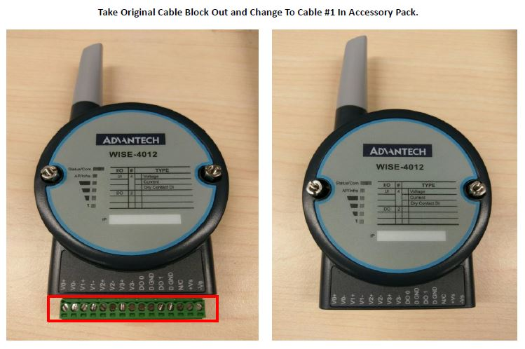
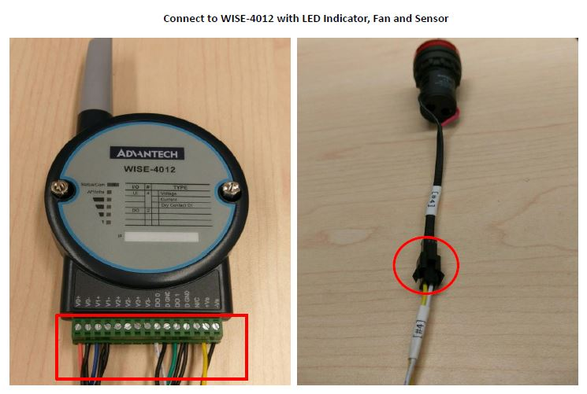
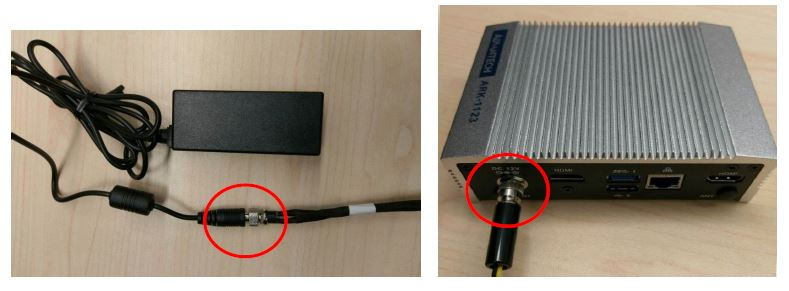
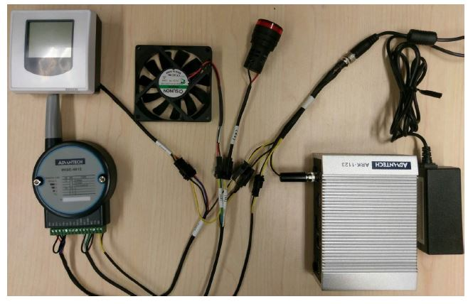
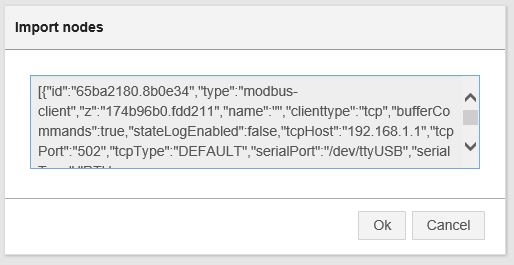
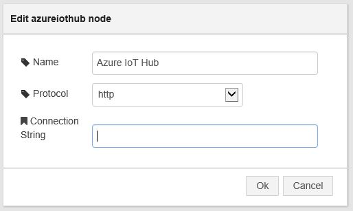
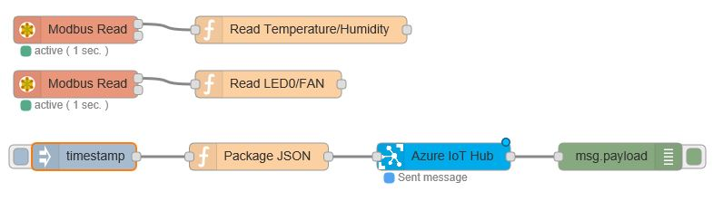

Run a simple nodejs sample on ARK-1123H device running Windows 10
===
---

# Table of Contents

-   [Introduction](#Introduction)
-   [Step 1: Prerequisites](#Prerequisites)
-   [Step 2: Prepare your Device](#PrepareDevice)
-   [Step 3: Build and Run the Sample](#Build)
    -   [Option 1: Use the development board, without sensors](#Device-Sample)
    -   [Option 2: Use the EIS-DK10 Kit from Advantech](#Kit01-Sample)
-   [Next Steps](#NextSteps)

# Introduction

**About this document**

This document describes how to connect ARK-1123H device running Windows 10 with Azure IoT SDK. This multi-step process includes:

-   Configuring Azure IoT Hub
-   Registering your IoT device
-   Build and deploy Azure IoT SDK on device

# Step 1: Prerequisites

You should have the following items ready before beginning the process:

-   [Prepare your development environment][setup-devbox-linux]
-   [Setup your IoT hub][lnk-setup-iot-hub]
-   [Provision your device and get its credentials][lnk-manage-iot-hub]
-   Computer with Git client installed
-   ARK-1123H device
-   Nodejs

# Step 2: Prepare your Device

-   Install Nodejs

# Step 3: Build and Run the Sample

## Option 1: Use the development board, without sensors

### 3.1 Load the Azure IoT bits and prerequisites on device

-   Create environment variable `IOTHUB_CONNECTION_STRING` and set its value as your **IoTHub connection string** which you got in [Step 1](#Prerequisites).

-   Open a Node.js command prompt.
		
-   Check all environment variables are properly set.

        echo %PATH%
        echo %OPENSSL_CONF%
        echo %IOTHUB_CONNECTION_STRING%
	
-   Download the SDK 

        git clone --recursive https://github.com/Azure/azure-iot-sdk-node.git

### 3.2 Build the samples

-   To validate the source code run the following commands on Node.js command prompt on Device.

        cd azure-iot-sdk-node
        build\dev-setup.cmd
        build\build.cmd > LogFile.txt

    ***Note:*** *LogFile.txt in above command should be replaced with a file name where build output will be written.*

-   Install npm package to run sample.

		cd \azure-iot-sdk-node\device\samples

    **For AMQP Protocol:**
	
        npm install azure-iot-device-amqp
	
    **For HTTP Protocol:**
	
        npm install azure-iot-device-http
	
    **For MQTT Protocol:**

        npm install azure-iot-device-mqtt	

-   Update the sample to set the protocol.

        cd azure-iot-sdk-node\device\samples
        notepad simple_sample_device.js

-   This launches a text editor. Scroll down to the protocol information and find the below code:

        var Protocol = require('azure-iot-device-amqp').Amqp;
	
    The default protocol used is AMQP. Code for other protocols(HTTP/MQTT) are mentioned just below the above line in the script. 
    Uncomment the line as per the protocol you want to use.

-   Scroll down to the connection information and find following placeholder for IoT connection string:

        var connectionString = "[IoT Device Connection String]";

-   Replace the above placeholder with device connection string. You can get this from DeviceExplorer as explained in [Step 1](#Prerequisites), that you copied into Notepad.

-   Save your changes and close the notepad.

-   Run the following command on Node.js command prompt before leaving the **azure-iot-sdk-node\device\samples** directory

        npm link azure-iot-device

### 3.3 Run and Validate the Samples

#### 3.3.1 Send Device Events to IoT Hub

-   Run the sample by issuing following command and verify that data has been successfully sent and received.

        node azure-iot-sdk-node\device\samples\simple_sample_device.js

-   See [Manage IoT Hub][lnk-manage-iot-hub] to learn how to observe the messages IoT Hub receives from the application.

#### 3.3.2 Receive messages from IoT Hub

-   See [Manage IoT Hub][lnk-manage-iot-hub] to learn how to send cloud-to-device messages to the application.

## Option 2: Use the EIS-DK10 Kit from Advantech

### EIS-DK10 starter kit

The EIS-DK10 starter kit includes:

-   ARK-1123H
-   Temperature/Humidity Sensor
-   LED Indicator
-   Cooling Fan
-   Wireless I/O Module

> *<http://www.advantech.com/products/071c0784-5e9b-4bb8-bb07-2cb06da757a1/eis-dk10/mod_83b56167-5f19-4967-9d0a-cc3c67cecb36>*

### Connect the sensors

Step 1: Connector sensor with cable

Step 2: Connect WISE-4012 to Devices

Step 3: Connect Power Converter Cable

Step 4: Connect Power Cable with Adaptor and System

Step 5: Done Assemble

### Build and Run the sample

#### Send Device Events to IoT Hub

-   Open Web Browser *127.0.0.1:1880*

-   Use Node-RED import below flow (Send data to IoT Hub)

        [{"id":"65ba2180.8b0e34","type":"modbus-client","z":"174b96b0.fdd211","name":"","clienttype":"tcp","bufferCommands":true,"stateLogEnabled":false,"tcpHost":"192.168.1.1","tcpPort":"502","tcpType":"DEFAULT","serialPort":"/dev/ttyUSB","serialType":"RTU-BUFFERD","serialBaudrate":"9600","serialDatabits":"8","serialStopbits":"1","serialParity":"none","serialConnectionDelay":"100","unit_id":1,"commandDelay":1,"clientTimeout":1000,"reconnectTimeout":2000},{"id":"a9cb598b.fd14d8","type":"azureiothub","z":"174b96b0.fdd211","name":"Azure IoT Hub","protocol":"http","x":553.5,"y":220,"wires":[["bb343e18.c74b"]]},{"id":"293750d.114997","type":"modbus-read","z":"174b96b0.fdd211","name":"","showStatusActivities":false,"showErrors":false,"unitid":"1","dataType":"HoldingRegister","adr":"0","quantity":"2","rate":"1","rateUnit":"s","server":"65ba2180.8b0e34","x":148.5,"y":80,"wires":[["62494a79.6cb0d4"],[]]},{"id":"6fc6bc1b.c16af4","type":"modbus-read","z":"174b96b0.fdd211","name":"","showStatusActivities":false,"showErrors":false,"unitid":"","dataType":"Coil","adr":"16","quantity":"2","rate":"1","rateUnit":"s","server":"65ba2180.8b0e34","x":148.5,"y":140,"wires":[["ef6bcf1b.6ae18"],[]]},{"id":"90c194dc.ff70f","type":"inject","z":"174b96b0.fdd211","name":"","topic":"","payload":"","payloadType":"date","repeat":"5","crontab":"","once":false,"x":157.5,"y":220,"wires":[["ecbef7d7.e553e8"]]},{"id":"ecbef7d7.e553e8","type":"function","z":"174b96b0.fdd211","name":"Package JSON","func":"var msgtemp = {\"payload\":{}};\nmsgtemp.payload[\"Temperature\"] = context.global.Temperature;\nmsgtemp.payload[\"Humidity\"] = context.global.Humidity; \nmsgtemp.payload[\"LED0\"] = context.global.LED0;  \nmsgtemp.payload[\"FAN\"] = context.global.FAN;  \nmsgtemp.payload = JSON.stringify(msgtemp.payload);\nreturn msgtemp;","outputs":1,"noerr":0,"x":350,"y":220,"wires":[["a9cb598b.fd14d8"]]},{"id":"bb343e18.c74b","type":"debug","z":"174b96b0.fdd211","name":"","active":true,"console":"false","complete":"false","x":748,"y":220,"wires":[]},{"id":"62494a79.6cb0d4","type":"function","z":"174b96b0.fdd211","name":"Read Temperature/Humidity","func":"context.global.Temperature = ((msg.payload[0] * 0.003052) - 100).toFixed(2);  \ncontext.global.Humidity = ((msg.payload[1] * 0.003052) - 100).toFixed(2);  \n","outputs":1,"noerr":0,"x":396.5,"y":80,"wires":[[]]},{"id":"ef6bcf1b.6ae18","type":"function","z":"174b96b0.fdd211","name":"Read LED0/FAN","func":"context.global.LED0 = msg.payload[0];  \ncontext.global.FAN = msg.payload[1];  \n","outputs":1,"noerr":0,"x":360.5,"y":140,"wires":[[]]}]

    

    

-   Replace Azure IoTHub node connection String

    

-   Then start send to IoT Hub.

-   We sent the Temperature/Humidity/LEO0/FAN to IoT Hub

    

-   See [Manage IoT Hub][lnk-manage-iot-hub] to learn how to observe the messages IoT Hub receives from the application.

#### Receive messages from IoT Hub

-   See [Manage IoT Hub][lnk-manage-iot-hub] to learn how to send cloud-to-device messages to the application.

# Next Steps

You have now learned how to run a sample application that collects sensor data and sends it to your IoT hub. To explore how to store, analyze and visualize the data from this application in Azure using a variety of different services, please click on the following lessons:

-   [Manage cloud device messaging with iothub-explorer]
-   [Save IoT Hub messages to Azure data storage]
-   [Use Power BI to visualize real-time sensor data from Azure IoT Hub]
-   [Use Azure Web Apps to visualize real-time sensor data from Azure IoT Hub]
-   [Weather forecast using the sensor data from your IoT hub in Azure Machine Learning]
-   [Remote monitoring and notifications with Logic Apps]   

[Manage cloud device messaging with iothub-explorer]: https://docs.microsoft.com/en-us/azure/iot-hub/iot-hub-explorer-cloud-device-messaging
[Save IoT Hub messages to Azure data storage]: https://docs.microsoft.com/en-us/azure/iot-hub/iot-hub-store-data-in-azure-table-storage
[Use Power BI to visualize real-time sensor data from Azure IoT Hub]: https://docs.microsoft.com/en-us/azure/iot-hub/iot-hub-live-data-visualization-in-power-bi
[Use Azure Web Apps to visualize real-time sensor data from Azure IoT Hub]: https://docs.microsoft.com/en-us/azure/iot-hub/iot-hub-live-data-visualization-in-web-apps
[Weather forecast using the sensor data from your IoT hub in Azure Machine Learning]: https://docs.microsoft.com/en-us/azure/iot-hub/iot-hub-weather-forecast-machine-learning
[Remote monitoring and notifications with Logic Apps]: https://docs.microsoft.com/en-us/azure/iot-hub/iot-hub-monitoring-notifications-with-azure-logic-apps
[setup-devbox-linux]: https://github.com/Azure/azure-iot-device-ecosystem/blob/master/get_started/node-devbox-setup.md
[lnk-setup-iot-hub]: ../setup_iothub.md
[lnk-manage-iot-hub]: ../manage_iot_hub.md
