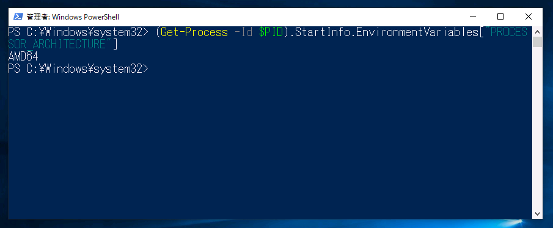
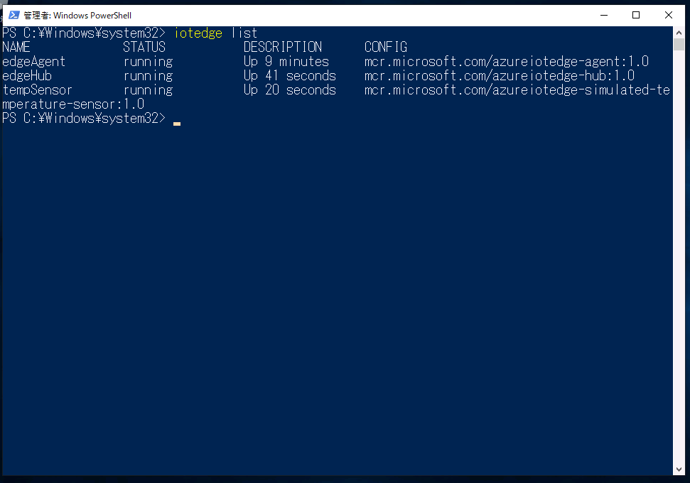

Run a simple C sample on Japan Shuttle DL1000S device running Windows 10 IoT Enterprise.
===
---

# Table of Contents

-   [Introduction](#Introduction)
-   [Step 1: Prerequisites](#Prerequisites)
-   [Step 2: Prepare your Device](#PrepareDevice)
-   [Step 3: Manual Test for Azure IoT Edge on device](#Manual)
-   [Next Steps](#NextSteps)

# Introduction

**About this document**

This document describes how to connect Japan Shuttle DL1000S  device running WIndows 10 IoT Enterprise with Azure IoT Edge Runtime pre-installed and Device Management. This multi-step process includes:

-   Configuring Azure IoT Hub
-   Registering your IoT device
-   Build and Deploy client component to test device management capability 

# Step 1: Prerequisites

You should have the following items ready before beginning the process:

-   [Prepare your development environment][setup-devbox-windows]
-   [Setup your IoT hub](https://account.windowsazure.com/signup?offer=ms-azr-0044p)
-   [Provision your device and get its credentials][lnk-manage-iot-hub]
-   [Sign up to IOT Hub](https://account.windowsazure.com/signup?offer=ms-azr-0044p)
-   [Add the Edge Device](https://docs.microsoft.com/en-us/azure/iot-edge/quickstart)
-   [Add the Edge Modules](https://docs.microsoft.com/en-us/azure/iot-edge/quickstart#deploy-a-module)
-   Japan Shuttle DL1000S  device.

# Step 2: Prepare your Device

-    Connect network cable, display cable, keyboard, mouse, and power cable.
-    Turn on your device then Windows 10 IoT Enterprise LTSC 2019 will boot up.

# Step 3: Manual Test for Azure IoT Edge on device

This section walks you through the test to be performed on the Edge devices running the Windows operating system such that it can qualify for Azure IoT Edge certification.

## 3.1 Edge RuntimeEnabled (Mandatory)

3.1.1  Create the Edge Device on Azure IoT Hub and copy the connection string.

3.1.2  Launch the PowerShell with administrator privilege.

3.1.3  Check installed Iot Edge version.

    iotedge version
    or
    iotedge --version

  

3.1.4  Check the architecture of runtime installed.
    
    (Get-Process -Id $PID).StartInfo.EnvironmentVariables["PROCESSOR_ARCHITECTURE"]

  

3.1.5  Check status of IoT Edge runtime
    
    Get-Service iotedge

3.1.6  To Provision the device, open the configuration file

-   Replace the device connection string 

        notepad C:\ProgramData\iotedge\config.yaml

        samaple
        --------------
        provisioning:
         source:"manual"
         device_connection_string:"<replace with the device connection string obtained in 3.1.1>"
-   save and close the file.

3.1.7 Restart the IoT Edge deamon

    Stop-Service iotedge -NoWait
    Sleep 5
    Start-service iotedge

3.1.8 Verify successful installation
-   Check the status of the IoT Edge Daemon

        Get-service iotedge

- Examine daemon logs

        . {Invoke-WebRequest -useb aka.ms/iotedge-win} | Invoke-Expression; Get-IoTEdgeLog

-   List running modules

        iotedge list        

## 3.2 Deploy Edge module on Edge Device

3.2.1 In the Azure Portal, navigat to your IoT Hub.

3.2.2 Go to **IoT Edge** and Select you IoT edge device.

3.2.3 Select **Set Modules**.

3.2.4 In the **Deployment Modules** section of the page, click **Add** then select **IoT Edge module**.

3.2.5 In the **Name** field, enter *tempSensor*.

3.2.6 In the **Image URI** field, enter "mcr.microsoft.com/azureiotedge-simulated-temperature-sensor:1.0"

3.2.7 Leave the other settings unchanged and select **Save**.

3.2.8 Back in the **Add modules** step, select **Next**.

3.2.9 In the **Specify routes** step, you should have a default route that sends all messages from all modules to IoT Hub.

3.2.10 In the**Review Deployment** step, select **Submit**.

3.2.11 Return to the device details page in Azure and selet **Refresh**. In addition to the **edgeAgent** module that was created when you first started the service, you should see another runtime module called **edgeHub** and the **tempSensor** module listed.

3.2.12 Check the list of running modules on Device (All the modules edge agent, edge hub and TempSensor should be in running state)

    iotedge list

3.2.13 Check the logs for the tempSensor Edge Module.

    iotedge logs SimulatedTemperaturesensor -f

# Next Steps

You have now learned how to run a sample application that collects sensor data and sends it to your IoT hub. To explore how to store, analyze and visualize the data from this application in Azure using a variety of different services, please click on the following lessons:

-   [Manage cloud device messaging with iothub-explorer]
-   [Save IoT Hub messages to Azure data storage]
-   [Use Power BI to visualize real-time sensor data from Azure IoT Hub]
-   [Use Azure Web Apps to visualize real-time sensor data from Azure IoT Hub]
-   [Weather forecast using the sensor data from your IoT hub in Azure Machine Learning]
-   [Remote monitoring and notifications with Logic Apps]   

[Manage cloud device messaging with iothub-explorer]: https://docs.microsoft.com/en-us/azure/iot-hub/iot-hub-explorer-cloud-device-messaging
[Save IoT Hub messages to Azure data storage]: https://docs.microsoft.com/en-us/azure/iot-hub/iot-hub-store-data-in-azure-table-storage
[Use Power BI to visualize real-time sensor data from Azure IoT Hub]: https://docs.microsoft.com/en-us/azure/iot-hub/iot-hub-live-data-visualization-in-power-bi
[Use Azure Web Apps to visualize real-time sensor data from Azure IoT Hub]: https://docs.microsoft.com/en-us/azure/iot-hub/iot-hub-live-data-visualization-in-web-apps
[Weather forecast using the sensor data from your IoT hub in Azure Machine Learning]: https://docs.microsoft.com/en-us/azure/iot-hub/iot-hub-weather-forecast-machine-learning
[Remote monitoring and notifications with Logic Apps]: https://docs.microsoft.com/en-us/azure/iot-hub/iot-hub-monitoring-notifications-with-azure-logic-apps
[setup-devbox-windows]: https://github.com/Azure/azure-iot-sdk-csharp/blob/master/doc/devbox_setup.md
[lnk-setup-iot-hub]: ../setup_iothub.md
[lnk-manage-iot-hub]: ../manage_iot_hub.md
