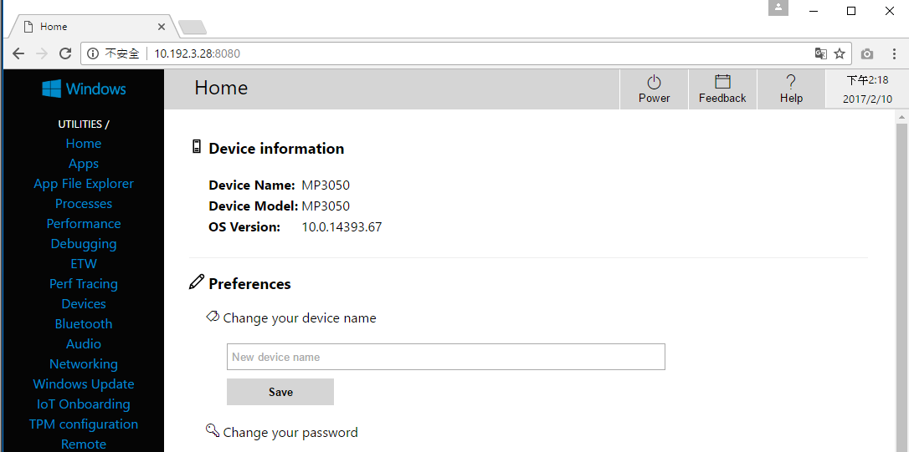
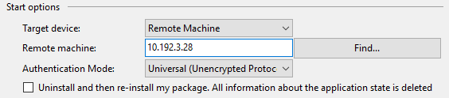

Run a simple Csharp sample on DE3250-S device running Windows IoT Core
===
---

# Table of Contents

-   [Introduction](#Introduction)
-   [Step 1: Prerequisites](#Prerequisites)
-   [Step 2: Prepare your Device](#PrepareDevice)
-   [Step 3: Build and Run the Sample](#Build)

# Introduction

**About this document**

This document describes how to connect DE3250-S device running Windows IoT Core with Azure IoT SDK. This multi-step process includes:
-   Configuring Azure IoT Hub
-   Registering your IoT device
-   Build and deploy Azure IoT SDK on device

# Step 1: Prerequisites

You should have the following items ready before beginning the process:

-   [Prepare your development environment][setup-devbox-windows]
-   [Setup your IoT hub][lnk-setup-iot-hub]
-   [Provision your device and get its credentials][lnk-manage-iot-hub]
-   DE3250-S device.

# Step 2: Prepare your Device

-   Connect the power adapter and Ethernet cable with AOPEN DE3250-S.
-   Press the power button.
-   Wait until the operating system is ready as shown as below.
    
-   Open Browser and access device through network to make sure your device is ready.

        http://<device_ip_address>:8080

    User Name: Administrator
    
    Password: P@ssw0rd

    

# Step 3: Build and Run the sample

-   Download the [Azure IoT SDK](https://github.com/Azure/azure-iot-sdks) and the sample programs and save them to your local repository.
-   Start a new instance of Visual Studio 2015.
-   Open the **iothub\_csharp\_deviceclient.sln** solution in the `csharp\device` folder in your local copy of the repository.
-   In Visual Studio, from Solution Explorer, navigate to the **samples** folder.
-   In the **UWPSample (Universal Windows)** project, open the ***IoTClient.cs*** file.
-   Locate the following code in the file:

        public const string DeviceConnectionString = "<replace>";
        
-   Replace `<replace>` with the connection string for your device.
-   Choose the right architecture “x64” and set the debugging method to "Remote Machine":

    To deploy the binaries on your device, right-click on the **UWPSample** project in the **Solution Explorer**, select **Properties** and navigate to the **Debug** tab:

    Type your *device name* or *ip address*. 

    Make sure the Authentication Mode is **Universal (Unencrypted Protocol)**

    

-   In **Solution Explorer**, right-click the **DeviceClientAmqpSample** project, click **Debug**, and then click **Start new instance** to build and run the sample. The console displays messages as the application sends device-to-cloud messages to IoT Hub.
-   Use the **DeviceExplorer** utility to observe the messages IoT Hub receives from the **Device Client AMQP Sample** application.
-   Refer "Monitor device-to-cloud events" in [DeviceExplorer Usage document](https://github.com/Azure/azure-iot-sdk-csharp/blob/master/tools/DeviceExplorer/doc/how_to_use_device_explorer.md) to see the data your device is sending.
-   Refer "Send cloud-to-device messages" in [DeviceExplorer Usage document](https://github.com/Azure/azure-iot-sdk-csharp/blob/master/tools/DeviceExplorer/doc/how_to_use_device_explorer.md) for instructions on sending messages to device.

[setup-devbox-windows]: https://github.com/Azure/azure-iot-sdk-c/blob/master/doc/devbox_setup.md
[lnk-setup-iot-hub]: ../setup_iothub.md
[lnk-manage-iot-hub]: ../manage_iot_hub.md
