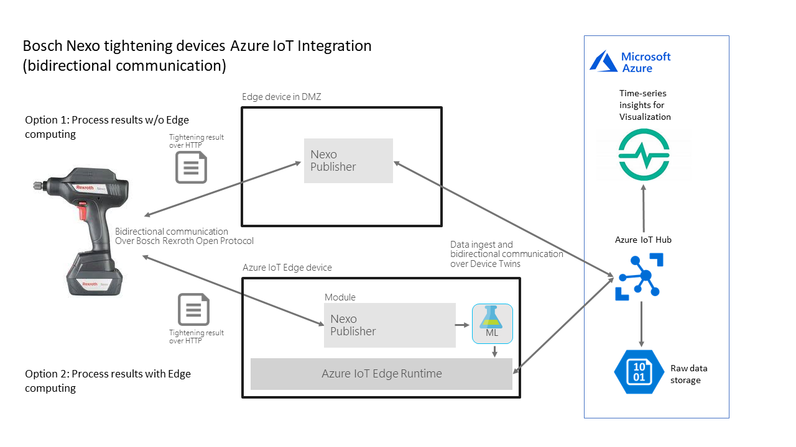
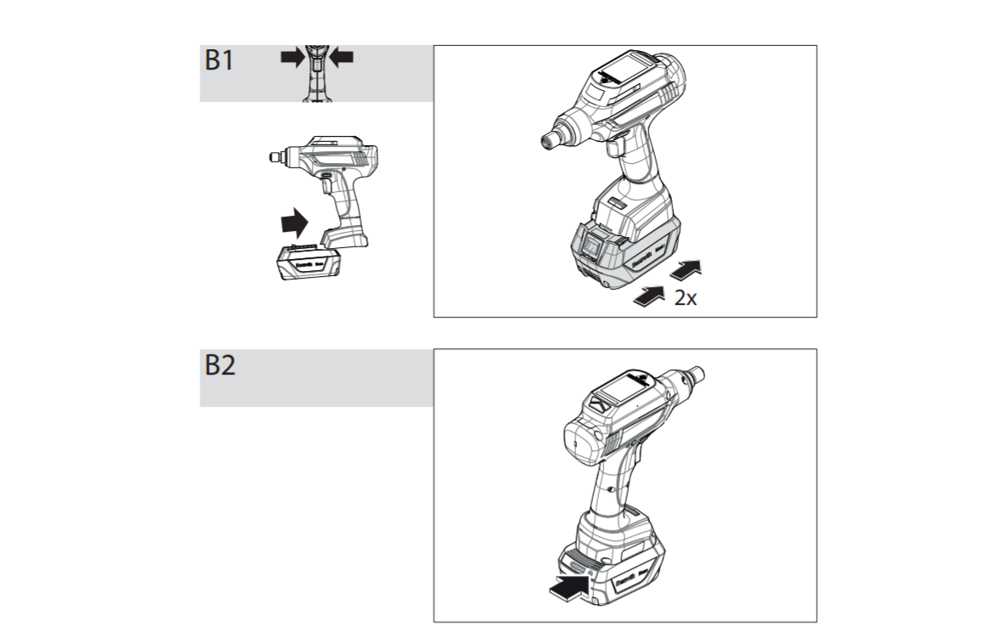
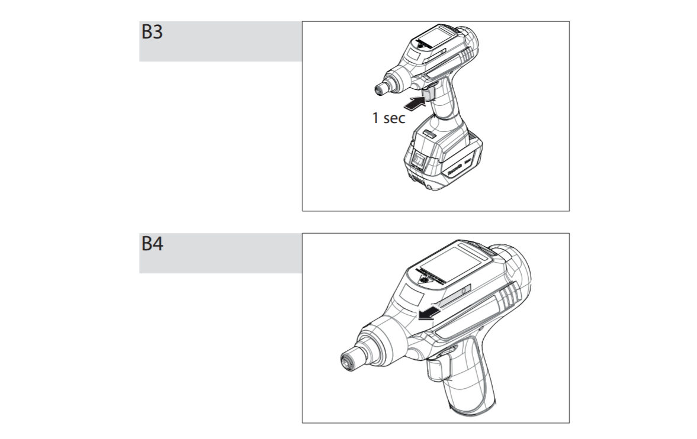

Run a simple JAVA sample on Windows to forward NEXO data to the Azure Cloud.
===
---

# Table of Contents

-   [Introduction](#Introduction)
-   [Step 1: Prerequisites](#Prerequisites)
-   [Step 2: Prepare your Device](#PrepareDevice)
-   [Step 3: Run the Sample](#Run)
-   [Step 4: Test the Sample](#Test)
-   [Next Steps](#NextSteps)

# Introduction

**About this document**

This document describes how to run a simple JAVA (NexoPublisher.jar) sample on a Windows computer. NexoPublisher JAVA application can receive NEXO data and forward it to the Azure Cloud as illustrated in the image bellow:

**This multi-step process includes:**

-   [Configuring Azure IoT Hub](https://github.com/Azure/azure-iot-device-ecosystem/blob/master/setup_iothub.md)
-   [Registering your IoT device](https://github.com/Azure/azure-iot-device-ecosystem/blob/master/setup_iothub.md)
-   [Preparing your Device](#PrepareDevice)
-   [Running the Sample](#Run)
-   [Testing the Sample](#Test)

# Step 1: Prerequisites

You should have the following items ready before beginning the process:

-   [Prepare your development environment][setup-devbox-windows]
-   [Setup your IoT hub](https://github.com/Azure/azure-iot-device-ecosystem/blob/master/setup_iothub.md)
-   [Provision your device and get its credentials](https://github.com/Azure/azure-iot-device-ecosystem/blob/master/manage_iot_hub.md)
-   [NEXO device](https://www.boschrexroth.com/de/de/produkte/direkteinstieg?cat=Tightening-System-Catalog&p=g306482#main-content)

# Step 2: Prepare your Device

1.  Connect your computer to NEXO according to the images bellow: 
 
     

     

     

     

     

    *Source:  [NEXO Handbook](https://github.com/NEXOBoschRexroth/Nexo-BCX19/blob/master/3608870EF2_AC.pdf) pg. 267-269*

2.  Second, configure NEXO to send data to the HTTP server running on the java sample (nexopublisher-1.0.0.jar from [JMayrbaeurl](https://github.com/JMayrbaeurl/azure-iotedge-boschnexo-sample)) as follow:

     
 
    *Adapted from: https://github.com/JMayrbaeurl/azure-iotedge-boschnexo-sample*

   After finishing the previous steps, NEXO will be ready to send data to the java application, nexopublisher-1.0.0.jar, every time a tightening program is executed. In the next stepy you will learn how to run the java application and how to start a tightening program with NEXO. 

# Step 3: Run the Sample

## 3.1 Install prerequisites

-   To run the sample you will need Java JRE 8. Download the JRE 8 Windows 10 installer from [https://java.com/de/download/win10.jsp](https://java.com/de/download/win10.jsp) and run it.

## 3.2 Download and run sample

1.  Download nexopublisher-1.0.1.jar from https://github.com/JMayrbaeurl/azure-iotedge-boschnexo-sample/releases

2.  Run the downloaded sample from the command line as follow:

        java -D"nexopublisher_protocol"=MQTT -D"nexopublisher_connectionString"="[Insert your IoT Hub connection string for the device here]"

   *Source:[https://github.com/JMayrbaeurl/azure-iotedge-boschnexo-sample](https://github.com/JMayrbaeurl/azure-iotedge-boschnexo-sample)*

# Step 4: Test the Sample

  In order to test if the java sample is forwarding the NEXO tightening data to the Azure Cloud you will need to select and execute a simple tightening program with NEXO while the java sample is running.

1.  Select a tightening program using NEXO display and buttons. NEXO is delivered with a basic program (program 99) which you can use for this test. For more details how to select the program, please refer to [NEXO Handbook](https://github.com/NEXOBoschRexroth/Nexo-BCX19/blob/master/3608870EF2_AC.pdf) pg. 38

2.  Execute the tightening program as follow:

    -   The tightening process is started using the start switch on the hand-held nutrunner.

       -   Keep the start switch pressed until the hand-held nutrunner switches off automatically.
       -   Releasing the start switch will abort the tightening operation.
  
   *Source:  [NEXO Handbook](https://github.com/NEXOBoschRexroth/Nexo-BCX19/blob/master/3608870EF2_AC.pdf) pg. 38*
   

# Next Steps

You have now learned how to run a sample application that collects sensor data and sends it to your IoT hub. To explore how to store, analyze and visualize the data from this application in Azure using a variety of different services, please click on the following lessons:

-   [Manage cloud device messaging with iothub-explorer]
-   [Save IoT Hub messages to Azure data storage]
-   [Use Power BI to visualize real-time sensor data from Azure IoT Hub]
-   [Use Azure Web Apps to visualize real-time sensor data from Azure IoT Hub]
-   [Weather forecast using the sensor data from your IoT hub in Azure Machine Learning]
-   [Remote monitoring and notifications with Logic Apps]   

[Manage cloud device messaging with iothub-explorer]: https://docs.microsoft.com/en-us/azure/iot-hub/iot-hub-explorer-cloud-device-messaging
[Save IoT Hub messages to Azure data storage]: https://docs.microsoft.com/en-us/azure/iot-hub/iot-hub-store-data-in-azure-table-storage
[Use Power BI to visualize real-time sensor data from Azure IoT Hub]: https://docs.microsoft.com/en-us/azure/iot-hub/iot-hub-live-data-visualization-in-power-bi
[Use Azure Web Apps to visualize real-time sensor data from Azure IoT Hub]: https://docs.microsoft.com/en-us/azure/iot-hub/iot-hub-live-data-visualization-in-web-apps
[Weather forecast using the sensor data from your IoT hub in Azure Machine Learning]: https://docs.microsoft.com/en-us/azure/iot-hub/iot-hub-weather-forecast-machine-learning
[Remote monitoring and notifications with Logic Apps]: https://docs.microsoft.com/en-us/azure/iot-hub/iot-hub-monitoring-notifications-with-azure-logic-apps
[setup-devbox-windows]: https://github.com/Azure/azure-iot-device-ecosystem/blob/master/get_started/java-devbox-setup.md
[lnk-setup-iot-hub]: ../setup_iothub.md
[lnk-manage-iot-hub]: ../manage_iot_hub.md
