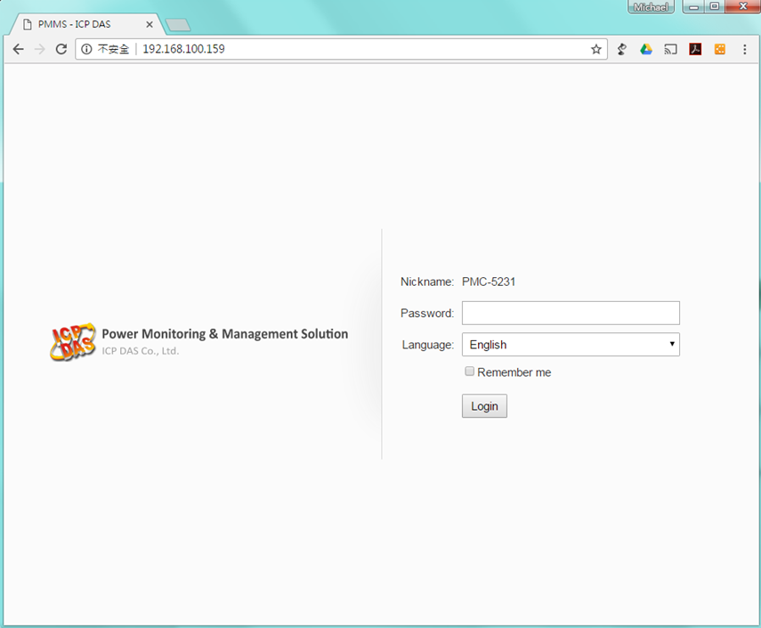
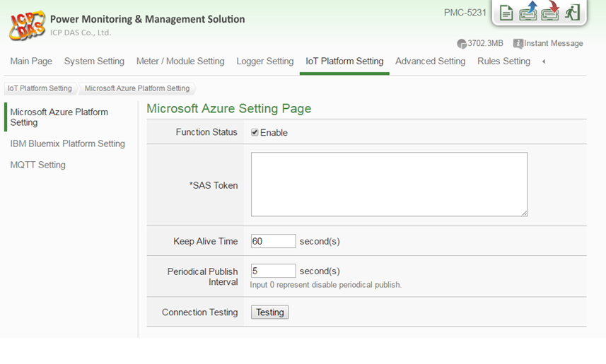
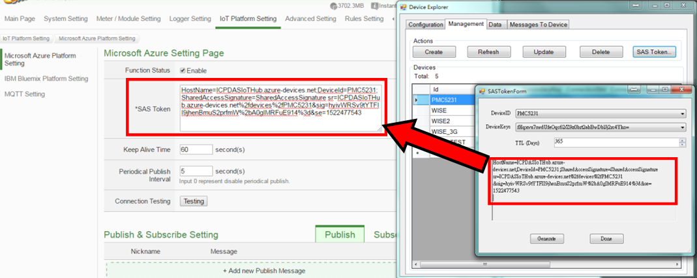
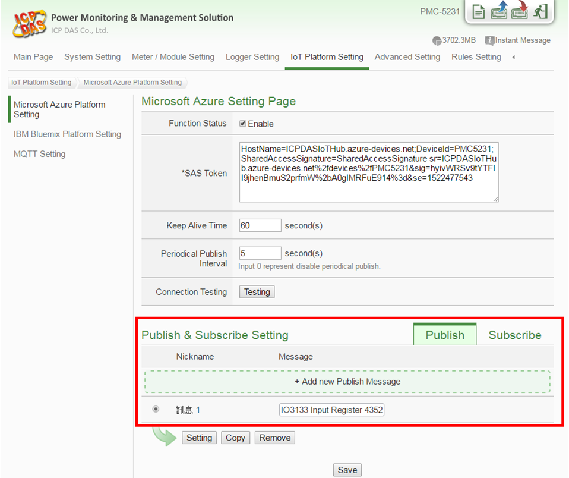
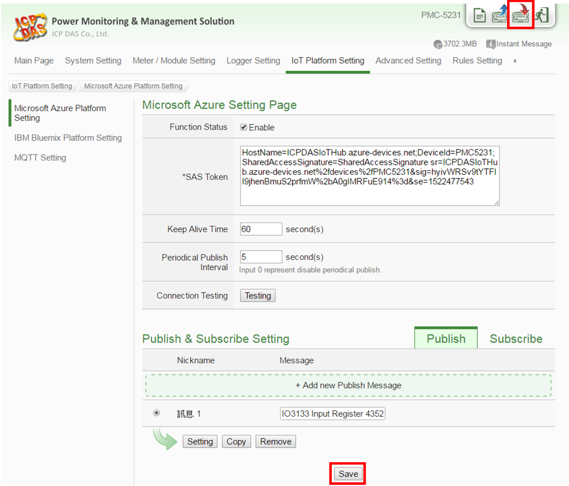
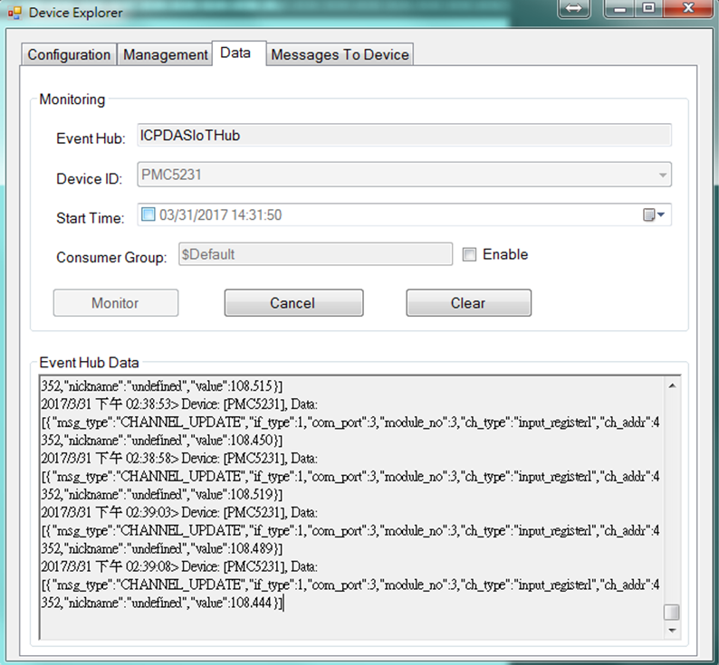
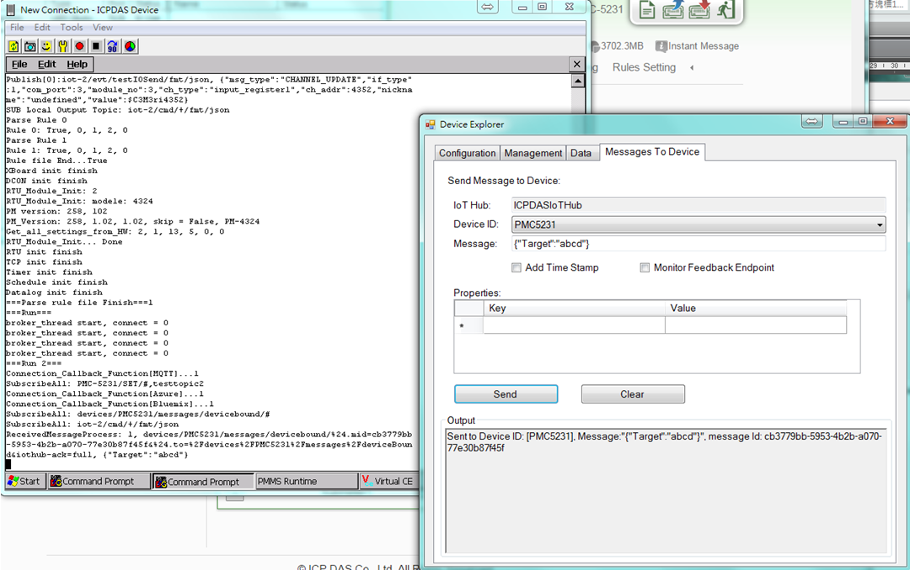

Run a simple Csharp sample on PMC-5231 device running WinCE 7.0
===
---

# Table of Contents

-   [Introduction](#Introduction)
-   [Step 1: Prerequisites](#Step-1-Prerequisites)
-   [Step 2: Prepare your Device](#Step-2-PrepareDevice)
-   [Step 3: Build and Run the Sample](#Step-3-Build)
-   [Next Steps](#NextSteps)

# Introduction

**About this document**

This document describes how to connect PMC-5231 device to Azure IoT Hub.

This multi-step process includes:
-   Configuring Azure IoT Hub
-   Registering your IoT device
-   Build and deploy Azure IoT SDK on device

# Step 1: Prerequisites

-   [Setup your IoT hub][lnk-setup-iot-hub]
-   [Provision your device and get its credentials][lnk-manage-iot-hub]
-   PMC-5231 device. 
-   Computer with a browser.

 

# Step 2: Prepare your Device

-   Follow the instruction described in this [Quick Start](http://pmms.icpdas.com/include/PMC_5231/PMC-5231%20Quick%20Start_v3.1.0.pdf) to Connect to the Web interface of PMC-5231.

# Step 3: Run the sample

-   Connect to PMC-5231 webpage server via Web browser, login with the default password "Admin".

    

-   Go to the "Microsoft Azure Setting" page.

    

-   Input the SAS Token generated by Device Explorer.

    

-   Edit the Message to send.

    

-   Click the Save button and write the settings to PMC-5231.

    

-   Use the DeviceExplorer utility to observe the messages IoT Hub receives from PMC-5231.

    

-   Use the DeviceExplorer utility to send the messages to PMC-5231.

    

# Next Steps

You have now learned how to run a sample application that collects sensor data and sends it to your IoT hub. To explore how to store, analyze and visualize the data from this application in Azure using a variety of different services, please click on the following lessons:

-   [Manage cloud device messaging with iothub-explorer]
-   [Save IoT Hub messages to Azure data storage]
-   [Use Power BI to visualize real-time sensor data from Azure IoT Hub]
-   [Use Azure Web Apps to visualize real-time sensor data from Azure IoT Hub]
-   [Weather forecast using the sensor data from your IoT hub in Azure Machine Learning]
-   [Remote monitoring and notifications with Logic Apps]   

[Manage cloud device messaging with iothub-explorer]: https://docs.microsoft.com/en-us/azure/iot-hub/iot-hub-explorer-cloud-device-messaging
[Save IoT Hub messages to Azure data storage]: https://docs.microsoft.com/en-us/azure/iot-hub/iot-hub-store-data-in-azure-table-storage
[Use Power BI to visualize real-time sensor data from Azure IoT Hub]: https://docs.microsoft.com/en-us/azure/iot-hub/iot-hub-live-data-visualization-in-power-bi
[Use Azure Web Apps to visualize real-time sensor data from Azure IoT Hub]: https://docs.microsoft.com/en-us/azure/iot-hub/iot-hub-live-data-visualization-in-web-apps
[Weather forecast using the sensor data from your IoT hub in Azure Machine Learning]: https://docs.microsoft.com/en-us/azure/iot-hub/iot-hub-weather-forecast-machine-learning
[Remote monitoring and notifications with Logic Apps]: https://docs.microsoft.com/en-us/azure/iot-hub/iot-hub-monitoring-notifications-with-azure-logic-apps
[lnk-setup-iot-hub]: ../setup_iothub.md
[lnk-manage-iot-hub]: ../manage_iot_hub.md
