Run a simple Csharp sample on PMC-5231 device running WinCE 7.0
===
---

# Table of Contents

-   [Introduction](#Introduction)
-   [Step 1: Prerequisites](#Step-1-Prerequisites)
-   [Step 2: Prepare your Device](#Step-2-PrepareDevice)
-   [Step 3: Build and Run the Sample](#Step-3-Build)
    -   [Option 1: Use the development board, without sensors](#Device-Sample)
    -   [Option 2: Use the Power Management IoT Kit from ICP DAS](#Kit01-Sample)
-   [Next Steps](#NextSteps)

# Introduction

**About this document**

This document describes how to connect PMC-5231 device to Azure IoT Hub.

This multi-step process includes:
-   Configuring Azure IoT Hub
-   Registering your IoT device
-   Build and deploy Azure IoT SDK on device

# Step 1: Prerequisites

-   [Setup your IoT hub][lnk-setup-iot-hub]
-   [Provision your device and get its credentials][lnk-manage-iot-hub]
-   PMC-5231 device. 
-   Computer with a browser.

 

# Step 2: Prepare your Device

-   Follow the instruction described in this [Quick Start](http://pmms.icpdas.com/include/PMC_5231/PMC-5231%20Quick%20Start_v3.1.0.pdf) to Connect to the Web interface of PMC-5231.

# Step 3: Run the sample

## Option 1: Use the development board, without sensors

-   Connect to PMC-5231 webpage server via Web browser, login with the default password "Admin".

    

-   Go to the "Microsoft Azure Setting" page.

    

-   Input the SAS Token generated by Device Explorer.

    

-   Edit the Message to send.

    

-   Click the Save button and write the settings to PMC-5231.

    

-   Use the DeviceExplorer utility to observe the messages IoT Hub receives from PMC-5231.

    

-   Use the DeviceExplorer utility to send the messages to PMC-5231.

    

## Option 2: Use the Power Management IoT Kit from ICP DAS

### Setup ICP DAS Power Management IoT Kit

Connect the modules as bellow provided by the IoT kit.

- 	PMC-5231: Industrial IoT Power Meter Concentrator
		
	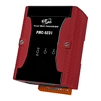

- 	PM-3114-100: 4 Loops single-phase Power Meter
	
	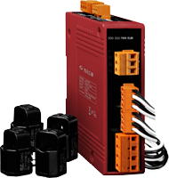

- 	MDR-20-24: 24W Industrial Power Supply

	

- 	Power cable

	

1.	Please refer to the figure as below to complete the wiring of RS-485 communication.
	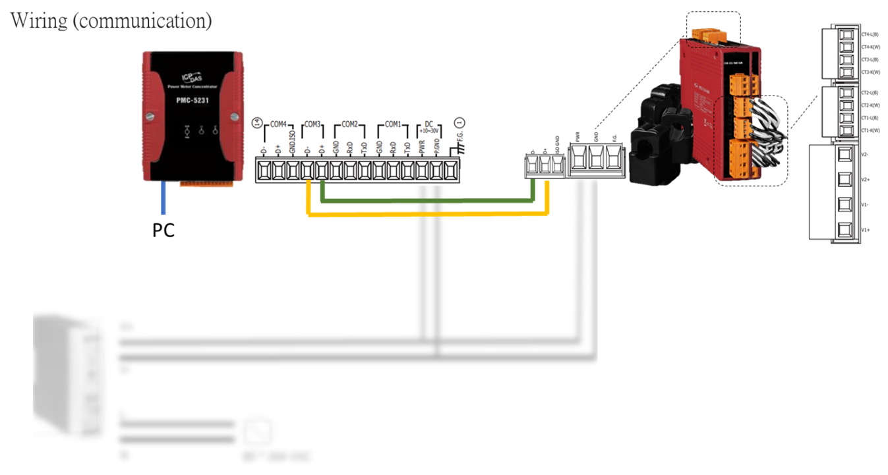

2.	Please refer to the figure as below for the wiring of power.
	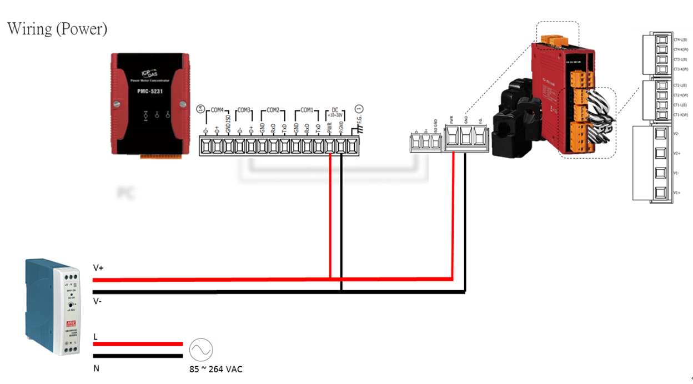

3.	Please refer to the figure as below for the wiring of power **(If you don’t need to measure the load, skip this section.)**
	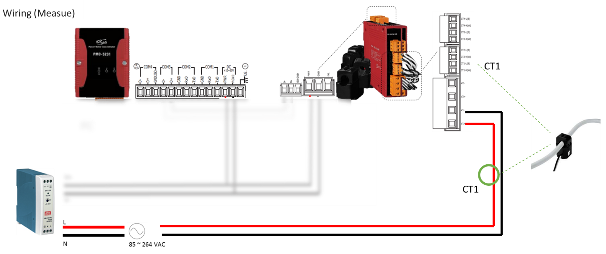

4.	After you've completed the wiring, the configuration will be the same as below.
	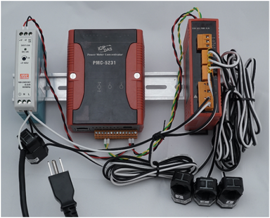
	

### Prepare your Device

-   Follow the instruction described in this [Quick Start](http://pmms.icpdas.com/include/PMC_5231/PMC-5231%20Quick%20Start_v3.1.0.pdf) to Connect to the Web interface of PMC-5231.

-   Follow the instruction described in this [Quick Start](http://ftp.icpdas.com/pub/cd/powermeter/pm-311x/quickstartguide/pm-311x%20quick_start_v1.2_en.pdf) to set PM-3133-100 and Meter parameters as following:
	
    -   Serial port parameters: 19200 N,8,1 (Default)
    -   Modbus Address:1 (Default) 

### Run the Sample

1.	Connect to PMC-5231 web server via browser, login with the default password "**Admin**".
	
	

2.	Go to the "**System setting** >> **I/O Interface Setting**" page to complete the setting of COM3.

	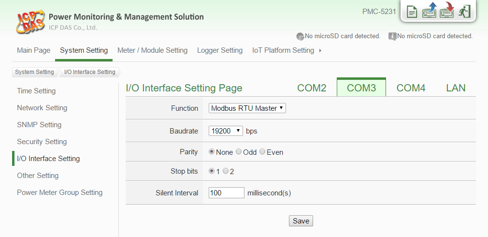

3.	Go to the "**Meter/Module Setting** >> **Power Meter Setting**" page to add the PM-3114 power meter.

	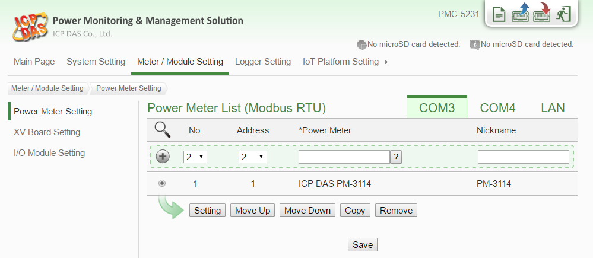

4.	Complete the settings, download the setting to PMC-5231, and then go to the "**Main Page**" to check the communication status with the power meter.

	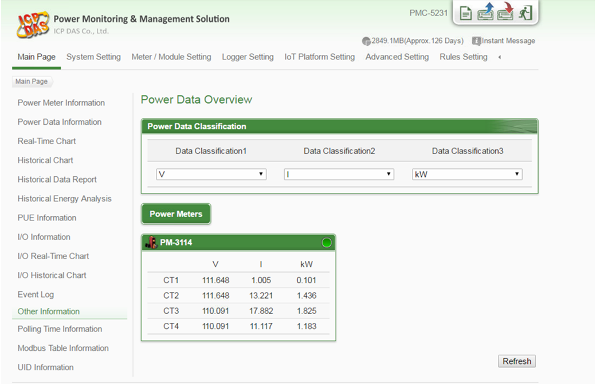

5.	Go to the "**Microsoft Azure Platform Setting**" page.

	

6.	Input the SAS Token generated by Device Explorer. (please refer previous section)

	

7.	Complete the Publish Message editing.

	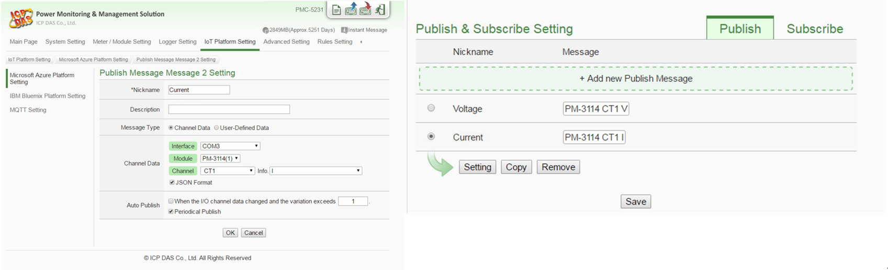

8.	Complete the Subscribe Message editing and click the "**Save**" button to save the settings.

	

9.	Go to the "**Rule Setting**" page to add a rule to turn the relay on when receive the message from Azure, then remember to download the setting to PMC-5231.

	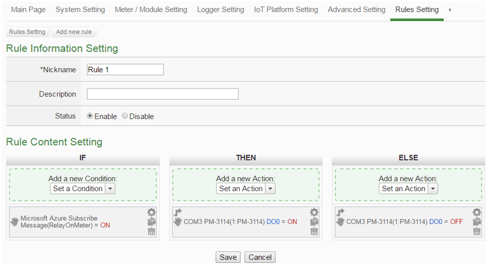

10.	Use the Device Explorer utility to verify if the IoT Hub receives the messages from PMC-5231.

	

11.	Go to the "**Main Page** >> **Power Meter Information** >> **I/O(Tab)**" page to observe that the relay status changes when PMC-5231 gets the message send by Device Explorer.

	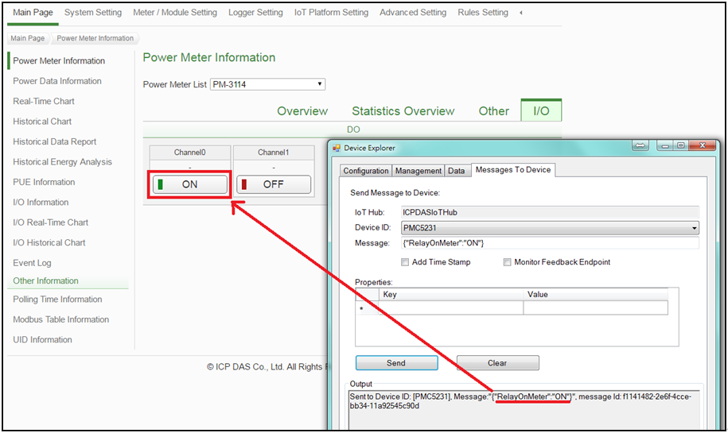
	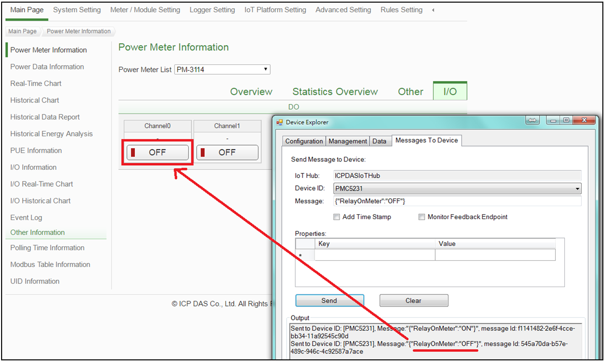

## Resource

-   [ICP DAS Power Management IoT Kit URL: http://pmms.icpdas.com/en/PMC_IoTKit_01.html](http://pmms.icpdas.com/en/PMC_IoTKit_01.html)

-   [Microsoft Azure IoT Starter Kits URL: http://aka.ms/iotstarterkits](http://aka.ms/iotstarterkits)

# Next Steps

You have now learned how to run a sample application that collects sensor data and sends it to your IoT hub. To explore how to store, analyze and visualize the data from this application in Azure using a variety of different services, please click on the following lessons:

-   [Manage cloud device messaging with iothub-explorer]
-   [Save IoT Hub messages to Azure data storage]
-   [Use Power BI to visualize real-time sensor data from Azure IoT Hub]
-   [Use Azure Web Apps to visualize real-time sensor data from Azure IoT Hub]
-   [Weather forecast using the sensor data from your IoT hub in Azure Machine Learning]
-   [Remote monitoring and notifications with Logic Apps]   

[Manage cloud device messaging with iothub-explorer]: https://docs.microsoft.com/en-us/azure/iot-hub/iot-hub-explorer-cloud-device-messaging
[Save IoT Hub messages to Azure data storage]: https://docs.microsoft.com/en-us/azure/iot-hub/iot-hub-store-data-in-azure-table-storage
[Use Power BI to visualize real-time sensor data from Azure IoT Hub]: https://docs.microsoft.com/en-us/azure/iot-hub/iot-hub-live-data-visualization-in-power-bi
[Use Azure Web Apps to visualize real-time sensor data from Azure IoT Hub]: https://docs.microsoft.com/en-us/azure/iot-hub/iot-hub-live-data-visualization-in-web-apps
[Weather forecast using the sensor data from your IoT hub in Azure Machine Learning]: https://docs.microsoft.com/en-us/azure/iot-hub/iot-hub-weather-forecast-machine-learning
[Remote monitoring and notifications with Logic Apps]: https://docs.microsoft.com/en-us/azure/iot-hub/iot-hub-monitoring-notifications-with-azure-logic-apps
[lnk-setup-iot-hub]: ../setup_iothub.md
[lnk-manage-iot-hub]: ../manage_iot_hub.md
