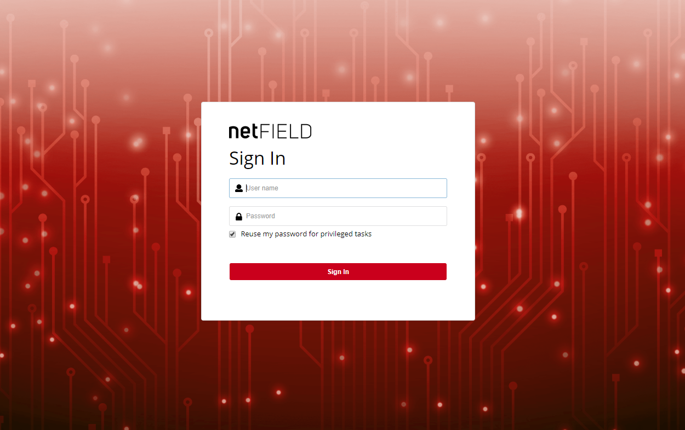
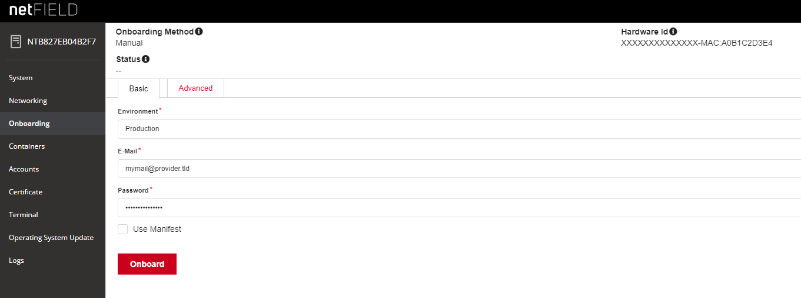
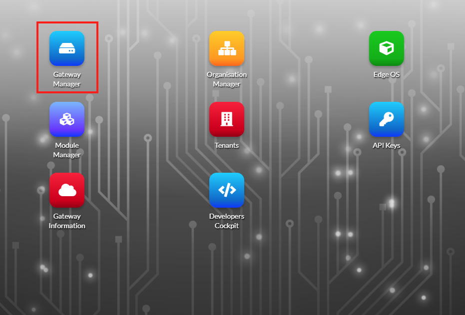
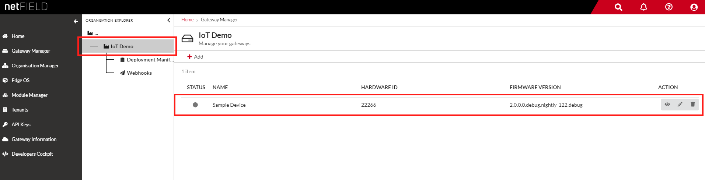
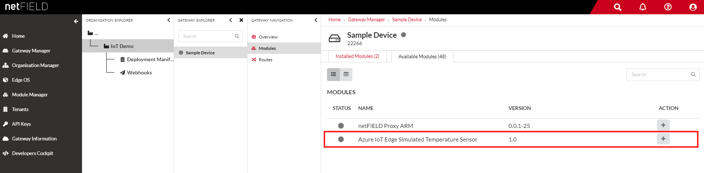
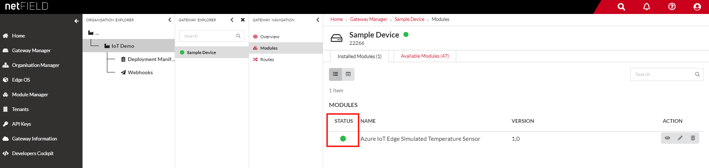

Run a simple Node.js sample on a Hilscher Edge to Enterprise IoT Gateway Connect device running Yocto
===
---

# Table of Contents

-   [Introduction](#Introduction)
-   [Step 1: Prerequisites](#Prerequisites)
-   [Step 2: Prepare your Device](#PrepareDevice)
-   [Step 3: Manual Test for Azure IoT Edge on device](#Manual)

# Introduction

**About this document**

This document describes how to connect a Hilscher Edge to Enterprise IoT Gateway Connect device running Yocto with Azure IoT Edge Runtime pre-installed and Device Management. This multi-step process includes:

-   Onboarding your device in your netFIELD instance
-   Deploying a sample module

# Step 1: Prerequisites

You should have the following items ready before beginning the process:

-   [Prepare your development environment][setup-devbox-linux]
-   Hilscher Edge to Enterprise IoT Gateway Connect device.
-   Login credentials to your netFIELD instance with device onboarding and module deployment privileges.

# Step 2: Prepare your Device

*Add steps for physically setting up the device*

Open the devices IP address in your browser and login to cockpit. Be sure to select "Reuse my password for privileged tasks".

Chose `Onboarding` in the lefthand menu. Select the environment applicable to you or click on `Advanced` in the upper tabs to provide custom API information.

Sign in to your netFIELD instance, select `Gateway Manager`

Select the organisation your device was onboarded for and select your device

Select `Available Modules` and chose a module to deploy by clicking on it

Click `Deploy` to deploy the module to your device

The device will download the module and install it. Once that process has finished, the status indicator on the `Modules` page of your device will change

# Step 3: Manual Test for Azure IoT Edge on device

This section walks you through the test to be performed on the Edge devices running the Linux operating system such that it can qualify for Azure IoT Edge certification.

## 3.1 Edge RuntimeEnabled (Mandatory)

**Details of the requirement:**

The following components come pre-installed or at the point of distribution on the device to customer(s):

-   Azure IoT Edge Security Daemon
-   Daemon configuration file
-   Moby container management system
-   A version of `hsmlib` 

*Edge Runtime Enabled:*

**Check the iotedge daemon command:** 

Open an ssh session with your IoT Edge device, confirm that the Azure IoT edge Daemon is under running state

    systemctl status iotedge

Open an ssh session with your IoT Edge device, confirm that the module deployed from the cloud is running on your IoT Edge device

    sudo iotedge list

 

## 3.2 Device Management (Optional)

**Pre-requisites:** Device Connectivity.

**Description:** A device that can perform basic device management operations (Firmware update) triggered by messages from IoT Hub
  
## 3.2.1 Firmware Update:

Sign in to your netFIELD instance and deploy the module `netfield-proxy` for your device. See [Step 2: Prepare your Device](#PrepareDevice) for detailed instructions.

After chosing your device in the `Gateway Manager`, select `netfield-proxy` from the `Gateway Navigation` sidebar

 

Chose the Edge OS version you want to update to by clicking on it.

Click `Deploy Edge OS`.

The image will be downloaded to your device and installed.

  
[setup-devbox-linux]: https://github.com/Azure/azure-iot-sdk-c/blob/master/doc/devbox_setup.md
[lnk-setup-iot-hub]: ../setup_iothub.md
[lnk-manage-iot-hub]: ../manage_iot_hub.md
