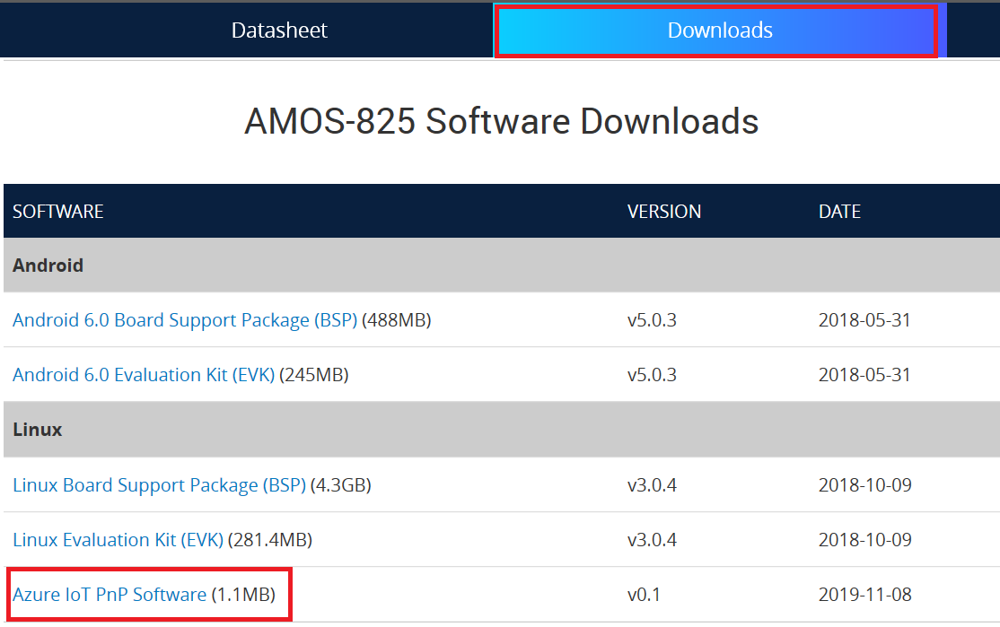

Connect VIA AMOS-825 device to your Azure IoT Central Application
===

---
# Table of Contents

-   [Introduction](#Introduction)
-   [Prerequisites](#Prerequisites)
-   [Create Azure IoT Central application](#Create_AICA)
-   [Device Connection Details](#DeviceConnectionDetails)
-   [Prepare the Device](#preparethedevice)
-   [Integration with IoT Central](#IntegrationwithIoTCentral)
-   [Additional Links](#AdditionalLinks)

<a name="Introduction"></a>
# Introduction 

**About this document**

This document describes how to connect VIA AMOS-825 to Azure IoT Central application using the IoT plug and Play model. Plug and Play simplifies IoT by allowing solution developers to integrate devices without writing any device code. Using Plug and Play, device manufacturers will provide a model of their device to cloud developers to be integrated quickly into IoT Central or any solution built on the Azure IoT platform. IoT Plug and Play will be open to the community by way of a definition language and SDKs.

Enhance commercial fleet safety and efficiency with the VIA AMOS-825 in-vehicle system. Powered by a 1.0GHz NXP i.MX 6Quad Cortex-A9 quad-core SoC, this fanless small form factor system has been specifically designed for demanding compute-intensive fleet management, navigation and infotainment applications. The low-power VIA AMOS-825 has been optimized for in-vehicle operation with a host of advanced features such as wide voltage input, a wide operating temperature range, sophisticated power management, ignition-controlled quick boot, and dual CAN bus support. With its robust and versatile design, the VIA AMOS-825 can be rapidly customized to meet a wide range of smart transportation requirements and has been successfully deployed by the largest taxi company in Japan for its Smart IoT Mobility System.

<a name="Prerequisites"></a>
# Prerequisites

You should have the following items ready before beginning the process: 

-   [Azure Account](https://portal.azure.com)
-   [Azure IoT Hub Instance](https://docs.microsoft.com/en-us/azure/iot-hub/about-iot-hub)
-   [Azure IoT Hub Device Provisioning Service](https://docs.microsoft.com/en-us/azure/iot-dps/about-iot-dps)
-   Provide Network connectivity (Wifi, LAN) supported by the device

<a name="preparethedevice"></a>
# Prepare the Device.

Hardware Environmental setup

- Prepare VIA AMOS-825 and connect with HDMI, 12V DC adapter, Ethernet, and COM port.

Software Environmental Setup 

-   Download VIA AMOS-825 [Linux Evaluation Kit (EVK)](http://cdn.viaembedded.com/products/software/amos-825/Linux_EVK/AMOS-825_Linux_EVK_v3.0.4_20181009.zip) from [VIA AMOS-825 Downloads](https://www.viatech.com/en/systems/industrial-fanless-pcs/amos-825/).
-   Download VIA AMOS-825 [Linux Quick Start Guide](http://cdn.viaembedded.com/products/docs/amos-825/Linux_quick_start_guide/AMOS-825_Linux_EVK_v3.0.4_Quick_Start_Guide_v1.00_20181004.pdf) from [VIA AMOS-825 Downloads](https://www.viatech.com/en/systems/industrial-fanless-pcs/amos-825/).
-   Follow the "Image Installation" in Quick Start Guide to install image on VIA AMOS-825 device.

-   Open putty or any tools to connect the COM port. You can see the message from VIA AMOS-825.
-   Download the [Azure IoT PnP Software](http://cdn.viaembedded.com/products/software/amos-825/Azure_IoT_PnP/VIA-AMOS825-PnP-Package.tgz) from [VIA AMOS-825 Downloads](https://www.viatech.com/en/systems/industrial-fanless-pcs/amos-825/).



-   Login VIA AMOS-825 with com port. The username is "root". Copy the **VIA-AMOS825-PnP-Package.tgz** to VIA AMOS-825 and extract the package by the command:

    ```bash
    $ tar zxvf VIA-AMOS825-PnP-Package.tgz
    ```

<a name="IntegrationwithIoTCentral"></a>
# Integration with IoT Central

Azure IoT Central Setup

-   Create an **Azure IoT Central accout** and launch the **public preview** application.
-   Click ***Administaration -> Device Connection -> Certificates (X.509)***.
-   Upload and verify your certificate.
-   Generate a device **certificate**, **private key** and remember your **Common Name** and **Scope Id**.
-   Click ***Device templates -> + New***. Choose pre-certified device "**VIA AMOS-825**".

**VIA AMOS-825 Setup**

-   Copy your device **certificate** and **private key** to ***VIA-AMOS825-PnP-Package/Certificate*** folder and rename as **device-ca.pem** and **device-key.pem**, respectively. 
-   Modify the device-name and scope-id in ***VIA-AMOS825-PnP-Package/pnp.conf*** to yours. The device-name is your certificate **Common Name** and **scope-id** is your **Azure IoT Central Scope Id**.
-   Change directory to VIA-AMOS825-PnP-Package and start the program by the command: 

    ```bash
    $ ./start.sh
    ```

**Check Azure IoT Central**
-   Clicks ***Devices***, and you can see that your VIA AMOS-825 register to IoT Central.
-   Click your VIA AMOS-825. You can see the messages from VIA AMOS-825 

<a name="AdditionalLinks"></a>
# Additional Links

Please refer to the below link for additional information for Plug and Play 

-   [Blog](https://azure.microsoft.com/en-us/blog/iot-plug-and-play-is-now-available-in-preview/)
-   [FAQ](TBD) 
-   [Plug and Play C SDK](https://github.com/Azure/azure-iot-sdk-c/tree/public-preview) 
-   [Plug and Play Node SDK](https://github.com/Azure/azure-iot-sdk-node/tree/digitaltwins-preview)
-   [Plug and Play Definitions](https://github.com/Azure/IoTPlugandPlay)
