Azure IoT Hub Connection
===
---

Eclipse Kura can connect to the Azure IoT Hub using the MQTT protocol. When doing so, Kura applications can send device-to-cloud messages. More information on the Azure IoT Hub and its support for the MQTT protocol can be found [here](https://docs.microsoft.com/en-us/azure/iot-hub/iot-hub-mqtt-support). This document outlines how to configure and connect a Kura application to the Azure IoT Hub.

## Provisionning device in Azure IoT Hub

After installing the new Azure connector in ESF (com.eurotech.framework.cloudconnection.azure.mqtt.provider-1.0.1.dp), two different connection methods are available:

-   TPM Endpoint for the devices that include a TPM
-   SaS Endpoint for the devices not equipped with a TPM

## TPM2 version:

The Azure cloudconnection provider has created a new service : **TPMInfoService**, containing the parameters of the TPM detected on the gateway.

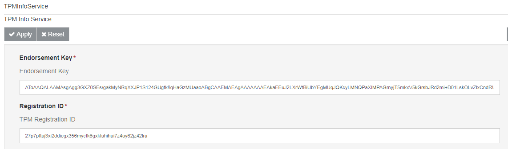

To provision the device in the Azure Portal, you need to use the Device Provisioning Service and add a new enrollment:

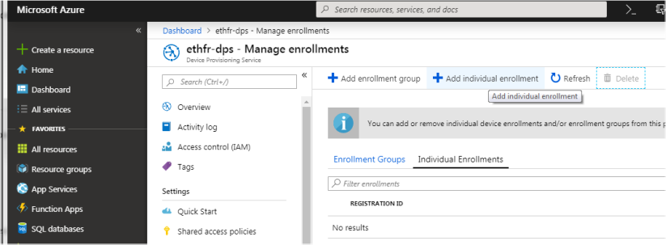

Select Mechanism = TPM, Copy/Paste the Endorsement key and the Registration ID, and enter the MAC address of the gateway in the IoT Hub Device ID

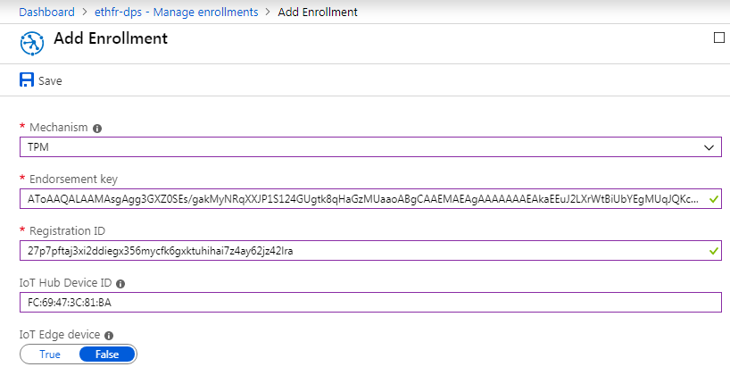

## SaS version:

In Microsoft Azure Portal, IoT Hub -> IoT Devices, add a new device with a device identity:

Open the device details and copy the “Connection string (primary key)” that will be used for creating the new Cloud connection:

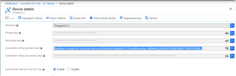

## Configuring a Kura Cloud Stack for Azure IoT Hub

The Kura Gateway Administrative Console exposes all services necessary to configure a connection to the Azure IoT Hub. You can follow the steps outlined below to configure the connection to the Azure IoT Hub.

The first step is to create a new Kura Cloud stack. From the Kura Gateway Administrative Console:

-   Select Cloud Services in the navigation on the left and click New to create a new Cloud stack

Here again, two different configurations depending on the connection method:

## TPM2 version

In ESF Web interface, create a new Cloud Connection using Factory AzureTPMCloudEndpoint

Select the new connection and configure TpmMqttDataTransport with the Azure Scope ID and Azure Global Endpoint from your Azure account:

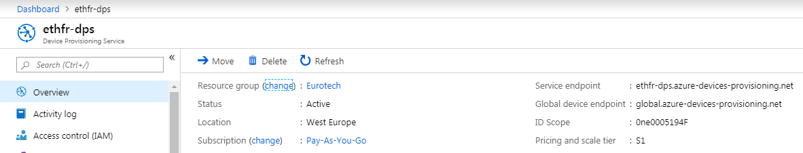

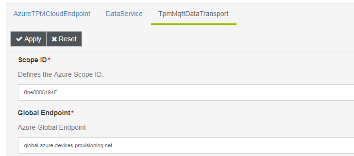

When the AzureTPMCloudEndpoint is connected, check in Azure Portal that the device has been registered

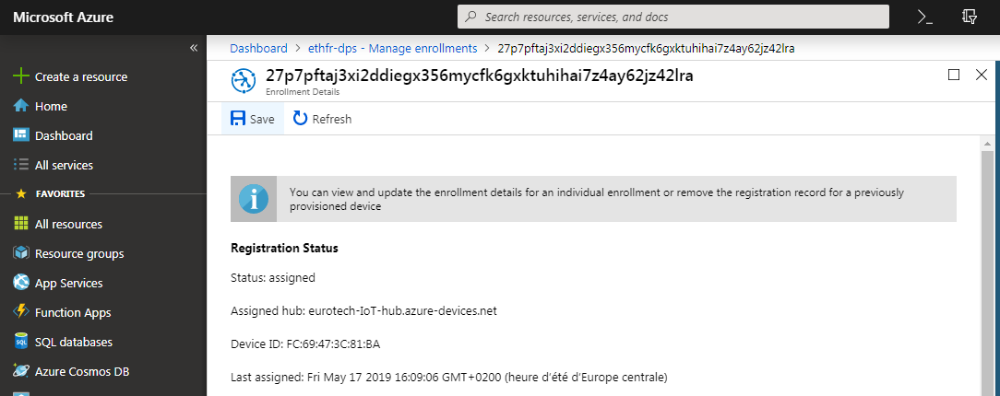

When the gateway connects for the first time a Device is created in the IoT Hub:

## SaS version

In ESF Web interface, create a new Cloud Connection using Factory AzureSasCloudEndpoint

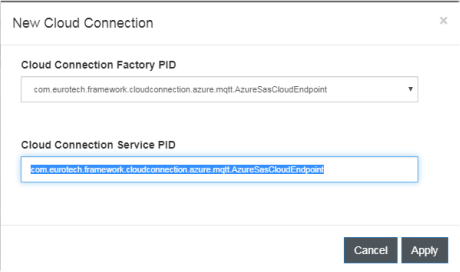

Select the new connection and configure SasMqttDataTransport with the Connection string that has been previously copied:

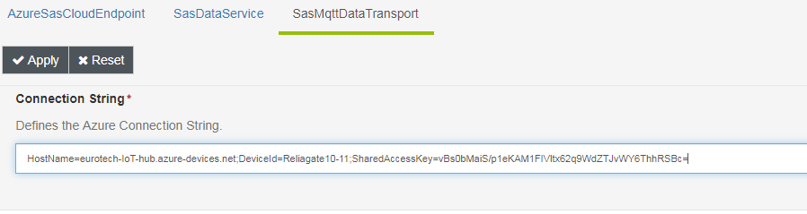

## DataService

In order for Kura to connect to Azure IoT Hub on startup, the *connect.auto-on-startup* option must be set to *true*. in DataService. If this value is changed from false to true, Kura will immediately begin the connection process. It is recommended that the CloudService and MqttDataTransport are configured before setting the *connect.auto-on-startup* option to true.

**Note:** Changing the value of *connect.auto-on-startup* from true to false **will not** disconnect the client from the broker. This setting simply implies that Kura will not automatically connect on the next start of Kura.

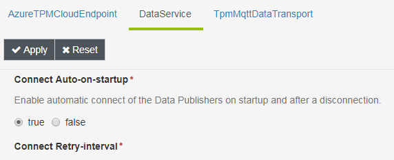

## Connect/Disconnect

The status panel can be used to manually connect or disconnect the client while Kura is running. The main button toolbar has a connect and disconnect button that may be used to control connectivity.

**Note:** Connecting or disconnecting the client via the status panel has no impact on Kura automatically connecting at startup. This capability is only controlled via the *connect.auto-on-startup* DataService setting.

## Kura Application Connecting to Azure IoT Hub

A new Publisher and a new Subscriber can be created in ESF Cloud Service. To create a "digital twin" in Azure IoT Hub, chose a Twin publisher/subscriber. If you want only publish data in Azure IoT Hub, create a Telemetry publisher.

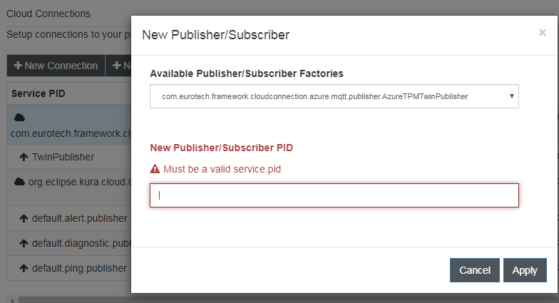

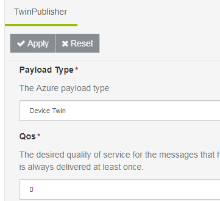

We can build a demo Wire Graph that will use these Pub/Sub

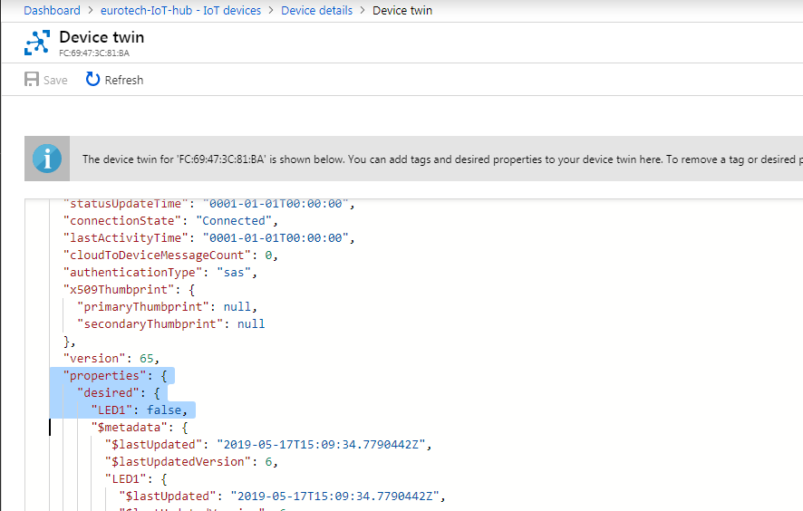

Modifying the “Desired properties” has a direct effect on the device: LED1 = true will activate the led.

