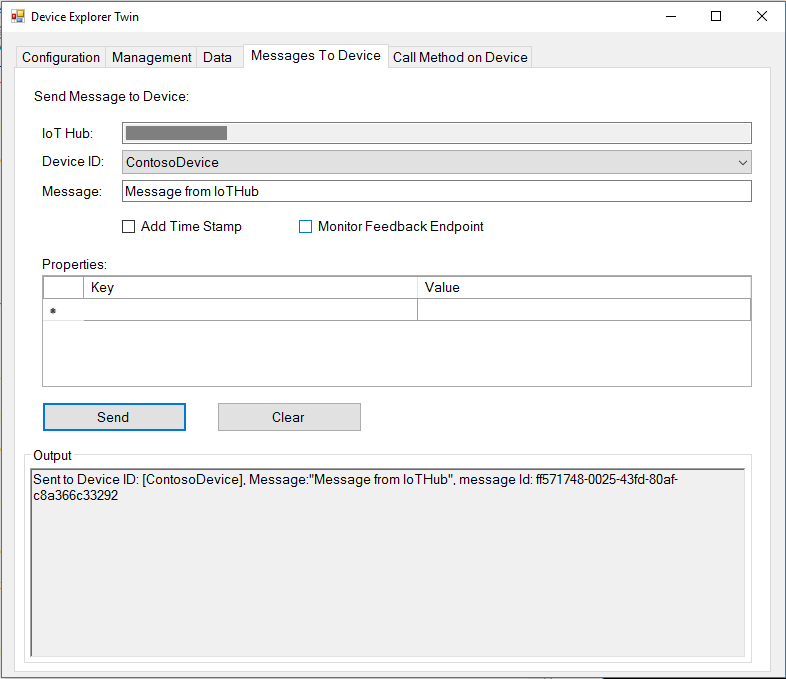

How to certify IoT devices running Linux with Azure IoT SDK
===
---

# Table of Contents

-   [Introduction](#Introduction)
-   [Step 1: Configure Azure IoT Hub](#Step-1-Configure)
-   [Step 2: Register Device](#Step-2-Register)
-   [Step 3: Build and Validate the sample using C client libraries](#Step-3-Build)
    -   [3.1 Load the Azure IoT bits and prerequisites on device](#Step-3-1-Load)
    -   [3.2 Build the samples](#Step-3-2-Build)
    -   [3.3 Run and Validate the Samples](#Step-3-3-Run)
-   [Step 4: Package and Share](#Step-4-Package_Share)
    -   [4.1 Package build logs and sample test results](#Step-4-1-Package)
    -   [4.2 Share package with Engineering Support](#Step-4-2-Share)
    -   [4.3 Next steps](#Step-4-3-Next)
-   [Step 5: Troubleshooting](#Step-5-Troubleshooting)

# Introduction

**About this document**

This document provides step-by-step guidance to IoT hardware publishers on how to certify an IoT enabled hardware with Azure IoT SDK. This multi-step process includes:

-   Configuring Azure IoT Hub
-   Registering your IoT device
-   Build and deploy Azure IoT SDK on device
-   Packaging and sharing the logs

**Prepare**

Before executing any of the steps below, read through each process, step by step to ensure end to end understanding.

You should have the following items ready before beginning the process:

-   Computer with GitHub installed and access to the
    [azure-iot-sdk-c](https://github.com/Azure/azure-iot-sdk-c) GitHub
    public repository.
-   SSH client, such as [PuTTY](http://www.putty.org/), so you can access the command line.
-   Required hardware to certify.

***Note:*** *If you haven't contacted Microsoft about being an Azure Certified for IoT partner, please submit this [form](<https://catalog.azureiotsuite.com/>) first to request it and then follow these instructions.*

# Step 1: Sign Up To Azure IoT Hub

[Sign up](https://account.windowsazure.com/signup?offer=ms-azr-0044p) to the Azure IoT Hub service and follow the instructions mentioned [here](https://docs.microsoft.com/en-us/azure/iot-hub/iot-hub-csharp-csharp-getstarted#create-an-iot-hub). As part of the sign up process, you will receive the connection string.

-   **IoT Hub Connection String**: An example of IoT Hub Connection String is as below:

         HostName=[YourIoTHubName];SharedAccessKeyName=[YourAccessKeyName];SharedAccessKey=[YourAccessKey]

# Step 2: Register Device

In this section, you will register your device using DeviceExplorer. The DeviceExplorer is a Windows application that interfaces with Azure IoT Hub and can perform the following operations:

-   Device management
    -   Create new devices
    -   List existing devices and expose device properties stored on Device Hub
    -   Provides ability to update device keys
    -   Provides ability to delete a device
-   Monitoring events from your device
-   Sending messages to your device

To run DeviceExplorer tool, use following configuration string as described in
[Step1](#Step-1-Configure):

-   IoT Hub Connection String

**Steps:**
1.  Click [here](<https://github.com/Azure/azure-iot-sdk-csharp/blob/master/tools/DeviceExplorer/doc/how_to_use_device_explorer.md>) to download and install DeviceExplorer.

2.  Add connection information under the Configuration tab and click the **Update** button.

3.  Create and register the device with your IoT Hub using instructions as below.

    a. Click the **Management** tab.

    b. Your registered devices will be displayed in the list. In case your device is not there in the list, click **Refresh** button. If this is your first time, then you shouldn't retrieve anything.

    c. Click **Create** button to create a device ID and key.

    d. Once created successfully, device will be listed in DeviceExplorer.

    e. Right click the device and from context menu select "**Copy connection
    string for selected device**".

    f. Save this information in Notepad. You will need this information in
    later steps.

***Not running Windows on your PC?*** - Please follow the instructions [here](<https://github.com/Azure/azure-iot-device-ecosystem/blob/master/manage_iot_hub.md>) to provision your device and get its credentials.

# Step 3: Build and Validate the sample using C client libraries

This section walks you through building, deploying and validating the IoT Client SDK on your device running a Linux operating system. You will install necessary prerequisites on your device. Once done, you will build and deploy the IoT Client SDK and validate the sample tests required for IoT certification with the Azure IoT SDK.

## 3.1 Load the Azure IoT bits and prerequisites on device

-   Open a PuTTY session and connect to the device.

-   Install the prerequisite packages by issuing the following commands from the command line on the device. Choose your commands based on the OS running on your device.

    **Debian or Ubuntu**

        sudo apt-get update

        sudo apt-get install -y curl uuid-dev libcurl4-openssl-dev build-essential cmake git

    **Fedora**

        sudo dnf check-update -y

        sudo dnf install uuid-devel libcurl-devel openssl-devel gcc-c++ make cmake git

    **Any Other Linux OS**

        Use equivalent commands on the target OS

    ***Note:*** *This setup process requires cmake version 2.8.12 or higher.* 
    
    *You can verify the current version installed in your environment using the  following command:*

        cmake --version

    *This library also requires gcc version 4.9 or higher. You can verify the current version installed in your environment using the following command:*
    
        gcc --version 

    *For information about how to upgrade your version of gcc on Ubuntu 14.04, see <http://askubuntu.com/questions/466651/how-do-i-use-the-latest-gcc-4-9-on-ubuntu-14-04>.*
    
-   Download the SDK to the board by issuing the following command in PuTTY:

        git clone --recursive https://github.com/Azure/azure-iot-sdk-c.git

-   Verify that you now have a copy of the source code under the
    directory ~/azure-iot-sdk-c.

## 3.2 Build the samples

There are two samples one for sending messages to IoT Hub and another for receiving messages from IoT Hub. Both samples supports different protocols. You can make modification to the samples with your choice of protocol before building the samples. By default the samples will build for AMQP protocol.  Follow the below instructions to edit the samples before building: 
    
### 3.2.1 Send Telemetry to IoT Hub Sample:

1.  Open the telemetry sample file in a text editor

		nano azure-iot-sdk-c/iothub_client/samples/iothub_ll_telemetry_sample/iothub_ll_telemetry_sample.c     

2. Find the following placeholder for IoT connection string:

        static const char* connectionString = "[device connection string]";

3. Replace the above placeholder with device connection string. You can get
    this from DeviceExplorer as explained in [Step 2](#Step-2-Register), that you copied into Notepad.
    
4. Find the following place holder for editing protocol:

		// The protocol you wish to use should be uncommented
		//
		#define SAMPLE_HTTP
		//#define SAMPLE_MQTT
		//#define SAMPLE_MQTT_OVER_WEBSOCKETS
		//#define SAMPLE_AMQP
		//#define SAMPLE_AMQP_OVER_WEBSOCKETS
	
5. Please uncomment the protocol that you would like to test with and comment other protocols. If testing for multiple protocols, please repeat above step for each protocol. 

6. Save your changes by pressing Ctrl+O and when nano prompts you to save it as the same file, just press ENTER.

7. Press Ctrl+X to exit nano.

### 3.2.1 Send message from IoT Hub to Device Sample:

1.  Open the telemetry sample file in a text editor

	 	nano azure-iot-sdk-c/iothub_client/samples/iothub_ll_c2d_sample/iothub_ll_c2d_sample.c
		
2.  Follow same steps 1-7 as above to edit this sample.

### 3.2.1 Build the samples:

1.  Build the SDK using following command. If you are facing any issues during build, follow troubleshooting [Step 5](#Step-5-Troubleshooting).

        sudo ./azure-iot-sdk-c/build_all/linux/build.sh | tee LogFile.txt
    
    ***Note:*** *LogFile.txt in above command should be replaced with a file name where build output will be written.*
    
    *build.sh creates a folder called "cmake" under "~/azure-iot-sdk-c/". Inside "cmake" are all the results of the compilation of the complete software.*

## 3.3 Run and Validate the Samples

In this section you will run the Azure IoT client SDK samples to validate
communication between your device and Azure IoT Hub. You will send messages to the Azure IoT Hub service and validate that IoT Hub has successfully receive the data. You will also monitor any messages send from the Azure IoT Hub to client.

**Note:** Take screenshots of all the operations you will perform in this
section. These will be needed in [Step 4](#Step-4-2-Share)

### 3.3.1 Send Device Events to IOT Hub:

1.  Launch the DeviceExplorer as explained in [Step 2](#Step-2-Register) and
    navigate to **Data** tab. Select the device name you created from the
    drop-down list of device IDs and click **Monitor** button.

    

2.  DeviceExplorer is now monitoring data sent from the selected device to the IoT Hub.

3.  Run the sample by issuing following command.    

		azure-iot-sdk-c/cmake/iotsdk_linux/iothub_client/samples/iothub_ll_telemetry_sample/iothub_ll_telemetry_sample

4.  Verify that the confirmation messages show an OK. If not, then you may have
    incorrectly copied the device hub connection information.

        

5.  DeviceExplorer should show that IoTHub has successfully received data sent by sample test.

        

### 3.3.2 Receive messages from IoT Hub

1.  Run the sample by issuing following command.

		azure-iot-sdk-c/cmake/iotsdk_linux/iothub_client/samples/iothub_ll_c2d_sample/iothub_ll_c2d_sample
		
2. To verify that you can send messages from the IoT Hub to your device,
    go to the **Message To Device** tab in DeviceExplorer.

3.  Select the device you created using Device ID drop down.

4.  Add some text to the Message field, then click Send.

    

5.  You should be able to see the command received in the console window for the
    client sample.

    
    

# Step 4: Package and Share

## 4.1 Package build logs and sample test results

Package following artifacts from your device:

1.  Build logs that were logged in the log files during build run.

2.  All the screenshots that are shown above in "**Send Device Events to IoT Hub**" section.

3.  All the screenshots that are above in "**Receive messages from IoT Hub**" section.

4.  Send us clear instructions of how to run this sample with your hardware
    (explicitly highlighting the new steps for customers). Please use the template available [here](<https://github.com/Azure/azure-iot-device-ecosystem/blob/master/iotcertification/templates/template-linux-c.md>) to create your device-specific instructions.
    
    As a guideline on how the instructions should look please refer the examples published on GitHub repository [here](<https://github.com/Azure/azure-iot-device-ecosystem/tree/master/get_started>).

## 4.2 Share package with Microsoft Azure IoT team

1.  Go to [Partner Dashboard](<https://catalog.azureiotsuite.com/devices>).
2.  Click on Upload icon at top-right corner of your device.

    

3.  This will open an upload dialog. Browse your file(s) by clicking **Upload** button.

    

    You can upload multiple files for same device.

4.  Once you have uploaded all the files, click on **Submit for Review** button.

    ***Note:*** *Please contact iotcert team to change/remove the files once you submit them for review.*
 

## 4.3 Next steps

Once you shared the documents with us, we will contact you in the following 48 to 72 business hours with next steps.

# Step 5: Troubleshooting

Please contact engineering support on <iotcert@microsoft.com> for help with
troubleshooting.