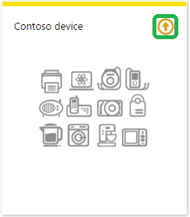
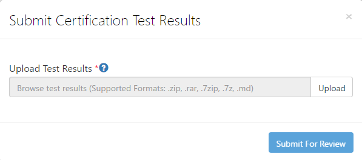

How to certify IoT Edge devices running Windows
===
---

# Table of Contents

-   [Introduction](#Introduction)
-   [Step 1: Configure Azure IoT Edge](#Step-1-Configure)
-   [Step 2: Register Device](#Step-2-Register)
-   [Step 3: Manual Test for Azure IoT Edge on device](#Step-3-Manual)
    -   [3.1 IoT Edge Runtime](#Step-3-1-IoTEdgeRunTime)
    -   [3.2 Device Management](#Step-3-2-DeviceManagement)
    -   [3.3 Security ](#Step-3-3-Security)
-   [Step 4: Package and Share](#Step-4-Package_Share)
    -   [4.1 Package build logs and Device in original box](#Step-4-1-Package-build)
    -   [4.2 Share package with Microsoft Azure IoT team](#Step-4-2-Share-Package)
    -   [4.3 Next steps](#Step-4-3-Next-Step)
-   [Step 5: Troubleshooting](#Step-5-Troubleshooting)

# Introduction

**About this document**

This document provides step-by-step guidance to IoT hardware publishers on how to certify an IoT Edge enabled hardware with Azure IoT SDK. This multi-step process includes:

-   Configuring Azure IoT Edge
-   Registering your IoT Edge device
-   Manual Test for Azure IoT Edge on device
-   Packaging and sharing the logs

**Prepare:**

Before executing any of the steps below, read through each steps to ensure end to end understanding.

You should have the following items ready before beginning the process:

-   Computer with GitHub installed and access to the [azure-iot-sdk](https://github.com/Azure/azure-iot-sdks) GitHub public repository.
-   Install [Visual Studio 2017](https://visualstudio.microsoft.com/downloads/) and necessary packages as stated in [System requirement](https://github.com/ms-iot/iot-core-azure-dm-client). You can install any edition of Visual Studio, including the free Community edition.

Note: If you haven't contacted Microsoft about being an Azure Certified for IoT partner, please submit this [form](https://catalog.azureiotsolutions.com/) first to request it and then follow these instructions.

# Step 1: Sign Up To Azure IoT Hub

[Sign up](https://account.windowsazure.com/signup?offer=ms-azr-0044p) to the Azure IoT Hub service and follow the instructions mentioned [here](https://docs.microsoft.com/en-us/azure/iot-edge/quickstart). As part of the sign up process, you will receive the connection string.

-   **IoT Hub Connection String**: An example of IoT hub Connection String is as below:

         HostName=[YourIoTHubName];SharedAccessKeyName=[YourAccessKeyName];SharedAccessKey=[YourAccessKey]

# Step 2: Register Device

In this section, you will register your Edge device using DeviceExplorer. The DeviceExplorer is a Windows application that interfaces with Azure IoT Hub and can perform the following operations:

-   Device management
    -   Create new devices
    -   List existing devices and expose device properties stored on Device Hub
    -   Provides ability to update device keys
    -   Provides ability to delete a device
-   Monitoring events from your device
-   Sending messages to your device

To run DeviceExplorer tool, use following configuration string as described in
[Step1](#Step-1-Configure):

-   IoT Hub Connection String

**Steps:**
1.  Click [here](<https://github.com/Azure/azure-iot-sdk-csharp/blob/master/tools/DeviceExplorer/doc/how_to_use_device_explorer.md>) to download and install DeviceExplorer.

2.  Add connection information under the Configuration tab and click the **Update** button.

3.  Create and register the device with your IoT Hub using instructions as below.

    a. Click the **Management** tab.

    b. Your registered devices will be displayed in the list. In case your device is not there in the list, click **Refresh** button. If this is your first time, then you shouldn't retrieve anything.

    c. Click **Create** button to create a device ID and key.

    d. Once created successfully, device will be listed in DeviceExplorer.

    e. Right click the device and from context menu select "**Copy connection
    string for selected device**".

    f. Save this information in Notepad. You will need this information in
    later steps.

***Not running Windows on your PC?*** - Please follow the instructions [here](<https://github.com/Azure/azure-iot-device-ecosystem/blob/master/manage_iot_hub.md>) to provision your device and get its credentials.

# Step 3: Manual Test for Azure IoT Edge on device

This section walks you through the test to be performed on the Edge devices running the Windows operating system such  that it can qualify for Azure IoT Edge certification 

## 3.1 Edge RuntimeEnabled (Mandatory)

*Total number of Level : 1*

**Description:** A device which includes the Azure IoT Edge runtime and dependencies.Download the Azure IoT Edge Runtime from the following path:

For Windows IoT Core, install runtime from the [link](https://github.com/MicrosoftDocs/azure-docs/blob/master/articles/iot-edge/how-to-install-iot-core.md).

For Windows x64 (AMD/Intel) to use with Linux containers, install runtime from the [link](https://github.com/MicrosoftDocs/azure-docs/blob/master/articles/iot-edge/how-to-install-iot-edge-windows-with-linux.md).

For Windows x64 (AMD/Intel) to use with Windows containers, install runtime from the [link](https://github.com/MicrosoftDocs/azure-docs/blob/master/articles/iot-edge/how-to-install-iot-edge-windows-with-windows.md).

**Details of the requirement:**

The following components come pre-installed or at the point of distribution on the device to customer(s):

-   Azure IoT Edge Security Daemon
-   Daemon configuration file
-   Moby container management system
-   A version of `hsmlib` 

The IoT Edge runtime becomes functional at boot via DPS integration or by the user entering device credentials into the **config** file.

**Test steps:**

-   Company must send the edge device to Microsoft for additional validation. We will send detail instructions and information we need when the company submit the device for Azure IoT edge certification.
-   Company needs to ensure sure that the edge device comes both Azure IoT Edge Security daemon and Moby container management system pre-installed
    -   Microsoft will check that the edge device comes with Azure IoT Edge Security Daemon
    -   Microsoft will check that the edge device comes with Moby container management system
-   Company needs to provide Microsoft the instruction on how to connect to IoT Hub via email
    -   Config file to connect
    -   How the device is provisioned
    -   Other important information 
-   Please allow some time to process and complete the certification process. Microsoft will ship back the edge device upon approval.

## 3.2 Device Management (Mandatory)
*Total number of Level : 1*

**Pre-requisites:** Device Connectivity.

**Description:** A device that can perform basic device management operations triggered by messages from IoT Hub.

**Details of the requirement:**

The device must have components that are capable of the following:

1.  Supports the use of device twins to trigger a firmware or operating system update and to report status including error messages or details
2.  Supports the use of direct methods to trigger a reboot and uses device twin to report last boot time.

The component may come pre-installed or at the point of distribution to the customer..

**Manual test:** 

The following test will validate that the Windows IoT Core device management client in installed and set to run as service

1.  Follow the steps for running the Azure certification steps for the Windows IoT [Device Management](https://github.com/ms-iot/iot-core-azure-dm-client/blob/master/docs/azure-dm-certification.md) Client. 
2.  Send the logfiles as part of your submission

## 3.3 Security (Optional)
*Total number of Levels : 4*

 **Note:** Microsoft is working on to define validation process for security requirement including exploration of leveraging 3rd party validation labs. 
 
#### 3.3.1 Device Security.Level1 

**Description:** 

Device is certified as Level 1 , if device has custom implementation of security protocols other than use of Azure IoT Device SDK. 

**Details of the requirement:**

-   Minimum security level 
-   IoT Edge devices without usage of Azure IoT Device SDK 
-   There is no test step for this requirement. Edge Runtime and connectivity to IoT Hub automatically make devices  eligible for this level 
 
#### 3.3.2 Device Security.Level2 

**Description:** 

Device is certified as Level 2 , if device can use Azure IoT Device SDKs to implement device security protocols. 

**Details of the requirement:**

-   Validates the usage of Azure IoT Device SDK 
 
#### 3.3.3 Device Security.Level 3 

**Description:**

 Device is certified as Level 3 , if device use hardware secure modules for security hardening.  Its validated through security certifications.
 
**Details of the requirement:**

This level require below Security certification requirement : 

-    FIPS 140-2 Level 2 or higher 
-    Common Criteria EAL 3+ 
 
#### 3.3.4 Device Security.Level 4 

**Description:**

 Device is certified as Level 4 , if device use hardware secure modules for security hardening.  Its validated through security certifications.
 
**Details of the requirement:** 

This level require below Security certification requirement :

-   FIPS 140-2 Level 3 or higher 
-   Common Criteria EAL 4+ 
    

# Step 4: Package and Share

## 4.1 Package build logs and Device in original box 
Package following artifacts from your device:

1.  Log files as stated in Device management manual test.
2.  Device with IoT Azure Runtime installed and shipped to Microsoft for further validation

## 4.2 Share package with Microsoft Azure IoT team

1.  Go to [Partner Dashboard](https://catalog.azureiotsolutions.com/devices)
2.  Click on Upload icon at top-right corner of device.

    

3.  This will open an upload dialog. Browse your file(s) by clicking Upload button.

    

    You can upload multiple files for same device.

4.  Once you have uploaded all the files, click on **Submit for Review** button.

    ***Note:*** *Please contact iotcert team to change/remove the files once you submit them for review.*

## 4.3 Next steps

Once you shared the documents with us, we will contact you in the following 48 to 72 business hours with next steps.

# Step 5: Troubleshooting

Please contact engineering support on <iotcert@microsoft.com> for help with troubleshooting.