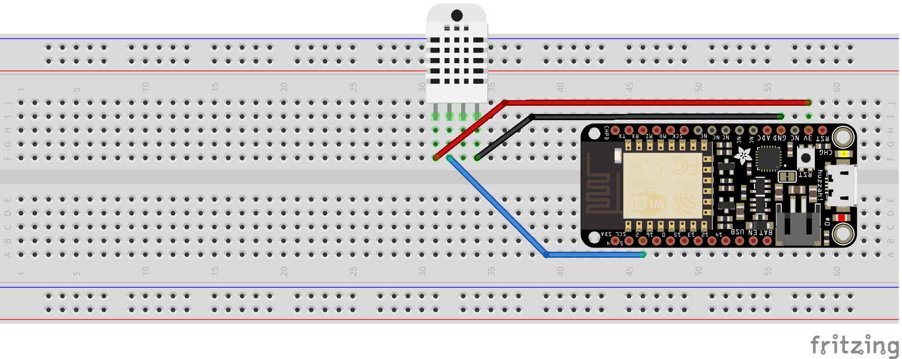
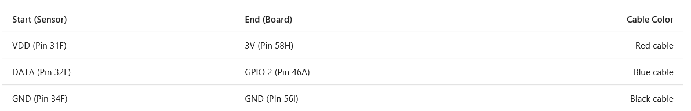

{Enter your kit name here} kit running {enter the OS name running on device}
===
---

# Table of Contents

-   Instructions for using this template
-   {Enter your kit name here} kit
-   Connect the sensors
-   Build and Run the sample
-   Send Device Events to IoT Hub
-   Receive messages from IoT Hub
-   Next steps

# Instructions for using this template

-   Replace the text in {placeholders} with correct values.
-   Delete the lines {{enclosed}} after following the instructions enclosed between them.
-   Remember that these instructions will be appended as a separate section at the bottom of the “Get Started” tutorial for the corresponding device in the [Device Catalog](http://catalog.azureiotsuite.com/)
-   Remove this section from final document.

# {Enter your kit name here} kit

The {Enter your kit name here} kit includes:

-   {enter the name of your Azure Certified for IoT device here} device.
-   {{Please specify any other hardware that is part of the kit.}}

# Connect the sensors 

{{Write down the instructions required to connect the sensors to the kit.

Option 1: If you use a breadboard, then for each sensor you need to show:

1.  A diagram created by the Fritzing tool (which you can download for free from <http://www.fritzing.org>) that shows how it is connected to the device
2.  A wiring matrix
3.  A picture showing how it is connected to the device

Note: If it is possible to connect multiple sensors simultaneously to the device and the corresponding images are not complicated, then you can submit images that show multiple sensors connected to the device.

Here is an example showing how to connect a DHT22 sensor to an Adafruit Feather Huzzah device:

1.  Fritzing diagram

2.  Wiring matrix

3.  Picture

Option 2: If you use a sensor board that includes all sensors and plugs directly into the device, we will need a picture showing how the sensor board is connected to the device. }}

# Build and Run the sample

{{Use similar instructions like the ones described for the device sample to show users how to build and run the sample that reads data from the sensors and sends it to IoT Hub}}

# Send Device Events to IoT Hub

{{Use similar instructions like the ones described for the device sample to show users how to send messages to IoT Hub}}

# Receive messages from IoT Hub

{{Use similar instructions like the ones described for the device sample to show users how to receive messages from IoT Hub}}

# Next steps

{{The following tutorials should work with your samples without any modifications, as long as you use the correct packet structure, which is defined in the document with the instructions for kit certification. If
you have a different packet structure and still want to support these tutorials, please provide instructions to the users about how to modify each tutorial accordingly}}

-   [Manage message exchanges between your device and IoT Hub using
    iothub-explorer](https://docs.microsoft.com/en-us/azure/iot-hub/iot-hub-explorer-cloud-device-messaging)
-   [Store data in Azure Storage](https://docs.microsoft.com/en-us/azure/iot-hub/iot-hub-store-data-in-azure-table-storage)
-   [Visualize data using PowerBI](https://docs.microsoft.com/en-us/azure/iot-hub/iot-hub-live-data-visualization-in-power-bi)
-   [Visualize data using Web Apps](https://docs.microsoft.com/en-us/azure/iot-hub/iot-hub-live-data-visualization-in-web-apps)
-   Use Machine Learning to predict upcoming data
-   Use Device Management to control devices from the cloud
    -   {{For your application to support Device Management (DM), you will need to make additional changes that are not covered in this document. We suggest that you look at the DM tutorial, to
        understand how you can add DM support to your application. However, if you do not modify your application accordingly, then you should not provide links to this tutorial. }}
-   Integrate with Logic Apps to email user about data anomalies