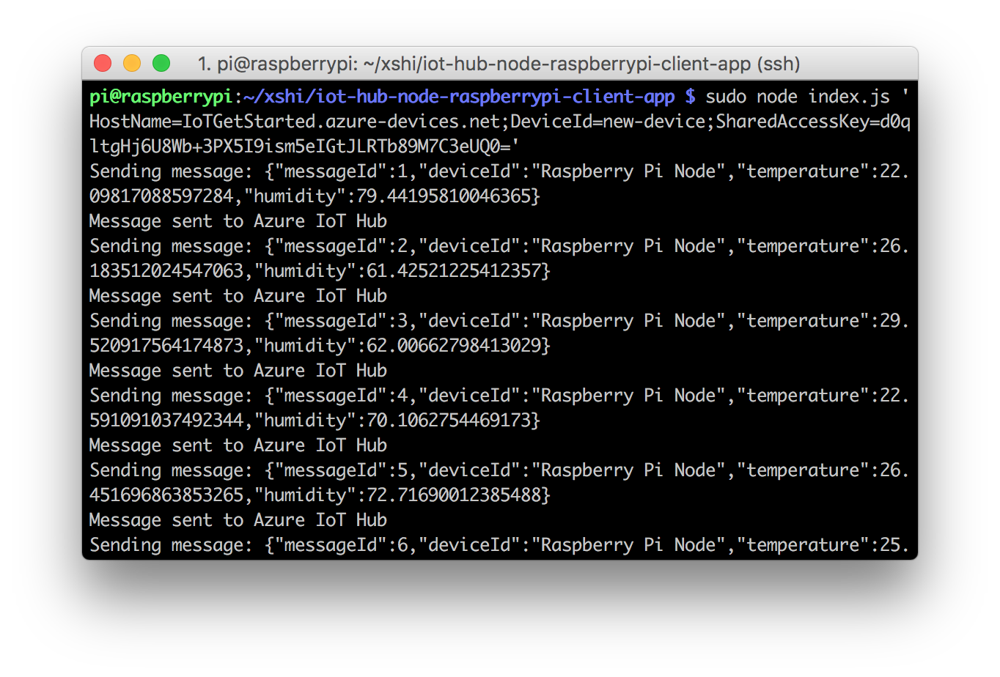

Raspberry Pi to Cloud kit running Raspbian Jessie
===
---

# Table of Contents

-   Instructions for using this template
-   Raspberry Pi to Cloud kit
-   Connect the sensors
-   Build and Run the sample
-   Send Device Events to IoT Hub
-   Receive messages from IoT Hub
-   Next steps

# Raspberry Pi to Cloud kit

The Raspberry Pi to Cloud kit includes:

-   Raspberry Pi 2 and Raspberry Pi 3 devices.

# What you need

-   The Raspberry Pi 2 or Raspberry Pi 3 board.
-   An active Azure subscription. If you don't have an Azure account, [create a free Azure trial account](https://azure.microsoft.com/free/) in just a few minutes.
-   A monitor, a USB keyboard, and mouse that connect to Pi.
-   A Mac or a PC that is running Windows or Linux.
-   An Internet connection.
-   A 16 GB or above microSD card.
-   A USB-SD adapter or microSD card to burn the operating system image onto the microSD card.
-   A 5-volt 2-amp power supply with the 6-foot micro USB cable.

The following items are optional:

-   An assembled Adafruit BME280 temperature, pressure, and humidity sensor.
-   A breadboard.
-   6 F/M jumper wires.
-   A diffused 10-mm LED.

# Connect the sensors 

Use the breadboard and jumper wires to connect an LED and a BME280 to Pi as follows. If you don’t have the sensor, skip this section.

1.  **Fritzing diagram**

    

2.  **Wiring matrix**

    For sensor pins, use the following wiring:

    | Start (Sensor & LED)     | End (Board)            | Cable Color   |
    | -----------------------  | ---------------------- | ------------: |
    | VDD (Pin 5G)             | 3.3V PWR (Pin 1)       | White cable   |
    | GND (Pin 7G)             | GND (Pin 6)            | Brown cable   |
    | SCK (Pin 8G)             | I2C1 SDA (Pin 3)       | Orange cable  |
    | SDI (Pin 10G)            | I2C1 SCL (Pin 5)       | Red cable     |
    | LED VDD (Pin 18F)        | GPIO 24 (Pin 18)       | White cable   |
    | LED GND (Pin 17F)        | GND (Pin 20)           | Black cable   |

    Click to view [Raspberry Pi 2 & 3 Pin mappings](https://developer.microsoft.com/windows/iot/docs/pinmappingsrpi) for your reference.

3.  **Picture**

    After you've successfully connected BME280 to your Raspberry Pi, it should be like below image.

    

# Build and Run the sample

### Clone sample application and install the prerequisite packages

1.  Use one of the following SSH clients from your host computer to connect to your Raspberry Pi.
    - [PuTTY](http://www.putty.org/) for Windows.
    - The built-in SSH client on Ubuntu or macOS.

2.  Clone the sample application by running the following command:

        git clone https//github.com/Azure-samples/iot-hub-node-raspberry-pi-clientapp

3.  Install all packages by the following command. It includes Azure IoT device SDK, BME280 Sensor library and Wiring Pi library.

        cd iot-hub-node-raspberry-pi-clientapp
        npm install

    > [!NOTE] 
    It might take several minutes to finish this installation process depending on your network connection.

### Configure the sample application

1.  Open the config file by running the following commands:

        nano config.json

    

    There are two items in this file you can configure. The first one is `interval`, which defines the time interval between two messages that send to cloud. The second one `simulatedData`,which is a Boolean value for whether to use simulated sensor data or not.

    If you **don't have the sensor**, set the `simulatedData` value to `true` to make the sample application create and use simulated sensor data.

2.  Save and exit by pressing Control-O > Enter > Control-X.

### Run the sample application

1.  Run the sample application by running the following command:

        sudo node index.js '<your Azure IoT hub device connection string>'

    > [!NOTE] 
    Make sure you copy-paste the device connection string into the single quotes.

    You should see the following output that shows the sensor data and the messages that are sent to your IoT hub.

    

# Send Device Events to IoT Hub

-   See [Manage IoT Hub][lnk-manage-iot-hub] to learn how to observe the messages IoT Hub receives from the application.

# Receive messages from IoT Hub

-   See [Manage IoT Hub][lnk-manage-iot-hub] to learn how to send cloud-to-device messages to the application.

# Next steps

-   [Manage message exchanges between your device and IoT Hub using
    iothub-explorer](https://docs.microsoft.com/en-us/azure/iot-hub/iot-hub-explorer-cloud-device-messaging)
-   [Store data in Azure Storage](https://docs.microsoft.com/en-us/azure/iot-hub/iot-hub-store-data-in-azure-table-storage)
-   [Visualize data using PowerBI](https://docs.microsoft.com/en-us/azure/iot-hub/iot-hub-live-data-visualization-in-power-bi)
-   [Visualize data using Web Apps](https://docs.microsoft.com/en-us/azure/iot-hub/iot-hub-live-data-visualization-in-web-apps)
-   Use Machine Learning to predict upcoming data
-   Integrate with Logic Apps to email user about data anomalies

[lnk-manage-iot-hub]: ../../manage_iot_hub.md
