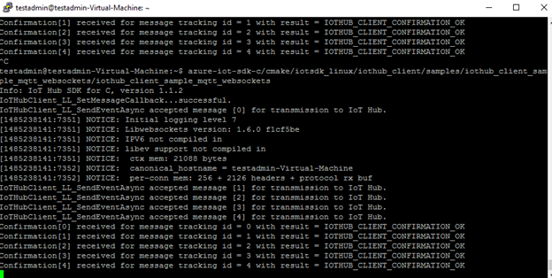
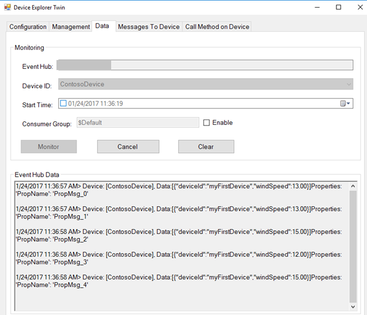
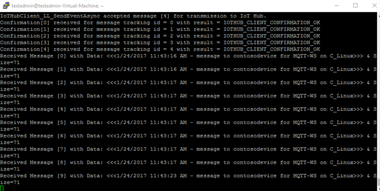

How to certify Microsoft Azure IoT Starter Kits
===
---
# Table of Contents

-   [Introduction](#Introduction)
-   [Requirements](#Requirements)
-   [Step 1: Run the "Get Started" tutorial for the device that is included in your kit](#Step1)
-   [Step 2: Modify the sample application to read data from the sensors and send it to the IoT Hub](#Step2)
-   [Step 3: Run and Validate the Samples](#Step3)
    -   [3.1 Send Device Events to IoT Hub](#Step3-1)
    -   [3.2 Receive messages from IoT Hub](#Step3-2)
-   [Step 4: Verify that your sample works with our IoT tutorials](#Step4)
-   [Step 5: Package and Share](#Step5)
    -   [5.1 Package build logs and sample test results](#Step5-1)
    -   [5.2 Share package with Engineering Support](#Step5-2)
    -   [5.3 OPTIONAL STEP: Send a kit to Microsoft](#Step5-3)
-   [Troubleshooting](#Troubleshooting)

# Introduction

**About this document**

Thank you for your interest in certifying your Microsoft Azure IoT Starter Kit.

This document provides step-by-step guidance to IoT hardware publishers on how to certify an IoT kit with Azure IoT SDK. This multi-step process includes:

- Starting with the tutorial for the Azure Certified for IoT device that is included in the kit
- Connecting sensors to the device
- Modifying the sample that was included in the device certification to read data from the sensors and send data to the cloud
- Packaging and sharing the logs

**Prepare**

Before executing any of the steps below, read through each process, step by step to ensure end to end understanding.

Before beginning the process you should:

-   Verify that your IoT kit is consistent with the requirements for the Microsoft Azure IoT Starter Kits, as they are described in the following section
-   Go to our [Device Catalog](http://catalog.azureiotsuite.com) and run through the "Get Started" tutorial for the device that is included in your kit. Confirm that everything works correctly, as this will be the starting point for the kit's "Get Started" tutorial

***Note:*** *If you haven't contacted Microsoft about being an Azure Certified for IoT partner, please submit this [form](https://catalog.azureiotsuite.com/) first to request it and then follow these instructions.*

# Requirements

The following list shows the requirements that must be met by a 3rd-party kit, in order to allow its owner to add it to our Device Catalog for kits.

**External packaging**

-   Shows the official name of the kit in the following format:
    \[Kit name\]
    Microsoft Azure IoT Starter Kit

    e.g.
    Foo Bar Kit
    Microsoft Azure IoT Starter Kit
-   Includes the [Azure Certified for IoT logo](images/logo.png) in a visible external location

**Kit contents**

The kit must include all items that are required for the kit to be functional:

-   A device that is Azure Certified for IoT
-   Sensors and/or actuators (one or more)
-   Everything required (e.g. cables, breadboard, etc) to connect the device to the sensors/actuators and to the computer
-   Any storage devices (e.g. SD card, USB stick, etc) that are required for the kit to be functional (if any)

Note: optionally, a kit can also include other items, (e.g. paper inserts, manual, USB stick, cables, etc.)

**Supporting URLs**

The following URLs need to be visible either in the external packaging or inside the box (e.g. in a paper insert, manual, etc)

-   The URL to the kit web page
-   Microsoft Azure IoT Starter Kits URL: [http://aka.ms/iotstarterkits](http://aka.ms/iotstarterkits)

**Kit web page**

The official web page for the kit must include the following:

-   Official name for the kit
-   Price (including any volume discounts)
-   Description
-   Picture(s) that show all the items inside the kit
-   List of all items inside the kit (e.g. device, sensors/actuators, cables, etc), as well as pointers to the following information for each item:

    -   Picture
    -   Price
    -   Description
    -   Technical characteristics or datasheet

Optional, but recommended: Describe the process on how a buyer of the kit can take the initial prototype that uses the kit and continue with the final product (e.g. S/W or H/W partners that the user can work with, other chipsets/boards that your company provides, etc).

# Step 1: Run the "Get Started" tutorial for the device that is included in your kit

Go to our [Device Catalog](http://catalog.azureiotsuite.com) and run the "Get Started" tutorial for the device that is included in your kit. Confirm that everything works correctly. If you find that the tutorial is broken, then please email <iotcert@microsoft.com> to let us know of the problem and whether you have a fix.

The sample in this step sends simulated data to the IoT Hub. The packet that is transmitted by this application has two fields:

1.  deviceId: String
2.  windSpeed: Float (random number)

# Step 2: Modify the sample application to read data from the sensors and send it to the IoT Hub

In this step, you will need to connect the sensors to the device and modify the previous sample, so that it reads data from the sensors and sends it to the IoT Hub.

Depending on the number and the type of the sensors that are included in your device, it might be easier to have one application that reads data from all sensors and sends all of it to the IoT Hub or to have multiple applications, each of which uses a subset of the sensors.

Regardless of the option that you choose, we recommend that your packet structure has fields that follow a similar pattern to the previous sample, e.g:

1.  deviceId: String
2.  messageId: Int (increasing number)
3.  temperature: Float
4.  humidity: Float
5.  pressure: Int

Based on the above configurations that you create, you also need to create instructions explaining how to connect each sensor to the device.

Option 1: If you use a breadboard, then for each sensor we will need:

1.  A diagram created by the Fritzing tool (which you can download for free from <http://www.fritzing.org>) that shows how it is connected to the device
2.  A wiring matrix
3.  A picture showing how it is connected to the device

Note: If it is possible to connect multiple sensors simultaneously to the device and the corresponding images are not complicated, then you can submit images that show multiple sensors connected to the device.

Here is an example showing how to connect a DHT22 sensor to an Adafruit Feather Huzzah device:

1.  Fritzing diagram

2.  Wiring matrix

3.  Picture

Option 2: If you use a sensor board that includes all sensors and plugs
directly into the device, we will need a picture showing how the sensor
board is connected to the device.

# Step 3: Run and Validate the Samples

In this section you will run the Azure IoT client SDK samples to validate communication between your device and Azure IoT Hub. You will send messages to the Azure IoT Hub service and validate that IoT Hub has successfully receive the data. You will also monitor any messages send from the Azure IoT Hub to client.

**Note:** Take screenshots of all the operations you will perform in this section. These will be needed in Step 4.

## 3.1 Send Device Events to IoT Hub

In this section we will use the [Device Explorer](https://github.com/Azure/azure-iot-sdk-csharp/blob/master/tools/DeviceExplorer/doc/how_to_use_device_explorer.md) application that you used in the tutorial for the device certification, in order to verify that your application can send messages to the IoT Hub. Device Explorer only runs on Windows, so if you use any other operating system, please use [iothub-explorer](https://github.com/Azure/iothub-explorer) to perform the same tasks.

1.  Launch Device Explorer and navigate to **Data** tab. Select the device name you created from the drop-down list of device IDs and click **Monitor** button.

2.  Device Explorer is now monitoring data sent from the selected device to the IoT Hub.

3.  Run your sample

4.  Verify that the confirmation messages show an OK. If not, then you may have incorrectly copied the device hub connection information. The following screenshots show the output from the default application that is used for the device certification.

**If using AMQP protocol:**

**If using HTTP protocol:**

**If using MQTT protocol:**

**If using WebSocket with AMQP protocol:**

	
**If using WebSocket with MQTT protocol:**

Explorer should show that IoT Hub has successfully received data sent by sample test. The following screenshots show the output from the default application that is used for the device certification.

**If using AMQP protocol:**

**If using HTTP protocol:**

**If using MQTT protocol:**

**If using WebSocket with AMQP protocol:**

	
**If using WebSocket with MQTT protocol:**

## 3.2 Receive messages from IoT Hub

1.  To verify that you can send messages from the IoT Hub to your device, go to the **Message To Device** tab in Device Explorer.

2.  Select the device you created using Device ID drop down.

3.  Add some text to the Message field, then click Send.

 The following screenshots show the output from the default application that is used for the device certification.

You should be able to see the command received in the console window for the client sample.

**If using AMQP protocol:**

**If using HTTP protocol:**

**If using MQTT protocol:**

**If using WebSocket with AMQP protocol:**

	
**If using WebSocket with MQTT protocol:**

# Step 4: Verify that your sample works with our IoT tutorials

At this point, you've validated that your device can successfully communicate with IoT Hub. However, in order to develop end-to-end scenarios, your users will also want to utilize a variety of additional Azure services. That's why we have created a set of tutorials that provide step-by-step guidance for the most common IoT use cases.

All these tutorials work without any modifications for any device that sends data to the IoT Hub using a packet that includes at least the following fields (there is no problem, if the packet has additional fields):

1.  deviceId: String
2.  messageId: Int
3.  temperature: Float
4.  humidity: Float

As long as you have an application that sends data using this format, it will be compatible with all future tutorials that we will develop, without any changes in your code.

However, even if your kit does not have temperature and humidity sensors, then the tutorial will also work, but they might need a few changes. We suggest that you try the tutorials and document the required changes, in order to make your kit compatible with them. In most cases, you will only need to point the user to a string change (e.g. from "temperature" to "acceleration").

Providing support for these tutorials is optional, however it will be a great addition to your kit.

The URLs for the tutorials are:

-   [Manage cloud device messaging with iothub-explorer](https://docs.microsoft.com/en-us/azure/iot-hub/iot-hub-explorer-cloud-device-messaging)
-   [Save IoT Hub messages to Azure data storage](https://docs.microsoft.com/en-us/azure/iot-hub/iot-hub-store-data-in-azure-table-storage)
-   [Use Power BI to visualize real-time sensor data from Azure IoT Hub](https://docs.microsoft.com/en-us/azure/iot-hub/iot-hub-live-data-visualization-in-power-bi)
-   [Use Azure Web Apps to visualize real-time sensor data from Azure IoT Hub](https://docs.microsoft.com/en-us/azure/iot-hub/iot-hub-live-data-visualization-in-web-apps)
-   [Weather forecast using the sensor data from your IoT hub in Azure Machine Learning](https://docs.microsoft.com/en-us/azure/iot-hub/iot-hub-weather-forecast-machine-learning)
-   [Remote monitoring and notifications with ​​Logic ​​Apps](https://docs.microsoft.com/en-us/azure/iot-hub/iot-hub-monitoring-notifications-with-azure-logic-apps)
-   [Device management with iothub-explorer](https://docs.microsoft.com/en-us/azure/iot-hub/iot-hub-device-management-iothub-explorer)
    -   Note: For your application to support Device Management (DM), you will need to make additional changes that are not covered in this document. We suggest that you look at the DM tutorial, to understand how you can add DM support to your application. However, if you do not modify your application accordingly, then you should not provide links to this tutorial.

# Step 5: Package and Share

## 5.1 Package build logs and sample test results

Package following artifacts from your device:

1.  Build logs and E2E test results that were logged in the log files during build run.

2.  All the screenshots that are shown above in "**Send Device Events to IoT Hub**" section.

3.  All the screenshots that are above in "**Receive messages from IoT Hub**" section.

4.  A picture of your kit external package and a screenshot of the kit web page. Both of them need to show the correct name of the kit, based on the [Kit Requirements](#Requirements). 

5.  If the kit includes a paper insert/manual, then provide us either with a digital copy or a picture. We want to verify that the urls described in the [Kit Requirements](#Requirements) are shown. If the kit does not have a paper manual/insert, then we need to see the urls in the external packaging, so please make sure that the picture in artifact #3 shows this.

6.  Send us a Pull Request with your code samples at [https://github.com/Azure/azure-iot-device-ecosystem/iotcertification/kits/samples/&lt;companyname&gt;/&lt;kitname&gt;/](https://github.com/Azure/azure-iot-device-ecosystem/iotcertification/kits/samples/%3ccompanyname%3e/%3ckitname%3e/%20)
    e.g.
    <https://github.com/Azure/azure-iot-device-ecosystem/iotcertification/kits/samples/contoso/iotdevkit/>

7.  Send us clear instructions of how to run these samples with your kit (explicitly highlighting the new steps for customers). Please use the template available [here](https://github.com/Azure/azure-iot-device-ecosystem/kits/getstarted/template-kits.md) to create your kit-specific instructions. These instructions will be appended as a separate section at the bottom of the "Get Started" tutorial for the corresponding device.

    As a guideline on how the instructions should look please refer to the existing "Get Started" guides from the other kits in the [Device Catalog](http://catalog.azureiotsuite.com).

## 5.2 Share package with Microsoft Azure IoT team

1.  Go to [Partner Dashboard](<https://catalog.azureiotsuite.com/devices>).
2.  Click on Upload icon at top-right corner of your kit.

3.  This will open an upload dialog. Browse your file(s) by clicking **Upload** button.

    You can upload multiple files for same device.

4.  Once you have uploaded all the files, click on **Submit for Review** button.

    ***Note:*** *Please contact iotcert team to change/remove the files once you submit them for review.*

5. Once you shared the documents with us, we will contact you in the following 48 to 72 business hours with next steps.

## 5.3 OPTIONAL STEP: Send a kit to Microsoft 
If you are interested in providing us with a kit, so that we can do periodic checks of your code and investigate whether it is still it is still compatible with our Azure IoT SDK, then please email us at <iotcert@microsoft.com>, after you complete your submission and we will provide you with further instructions.

If you are not interested in this, then you do not need to provide us with a kit.

# Troubleshooting

If you face any issues while compiling the existing sample code for your device, then you can look at the [corresponding certification guide](https://github.com/Azure/azure-iot-device-ecosystem/tree/master/iotcertification) for your OS and language.

For additional help with troubleshooting, please contact engineering support at <iotcert@microsoft.com>

