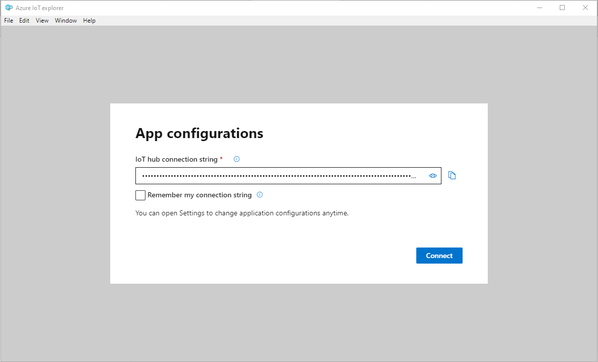
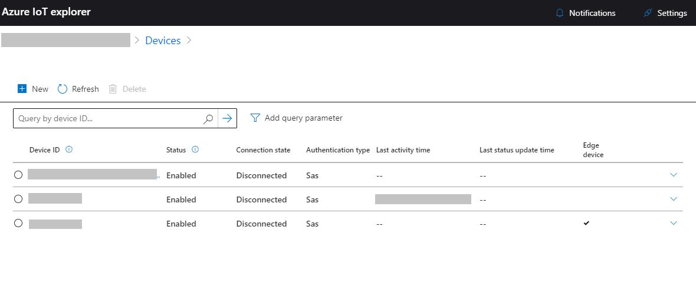

# Manage IoT Hub

Before a device can communicate with IoT Hub, you must add details of that device to the IoT Hub device identity registry. When you add a device to your IoT Hub device identity registry, the hub generates the connection string that the device must use when it establishes its secure connection to your hub. You can also use the device identity registry to disable a device and prevent it from connecting to your hub.

To add devices to your IoT hub and manage those devices, you can use either of:

- The cross-platform, command-line [iothub-explorer](#iothub-explorer) tool
- The Windows-only, graphical [Azure IOT Explorer](#pnp-explorer)

Use either of these tools to generate a device-specific connection string that you can copy and paste in the source code of the application running on your device. Both tools are available in this [repository][lnk-this-repo].
 
> Note: While IoT Hub supports multiple authentication schemes for devices, both these tools generate a pre-shared key to use for authentication.

> Note: You must have an IoT hub running in Azure before you can provision your device. The document [Set up IoT Hub][setup-iothub] describes how to set up an IoT hub.

You can also use both of these tools to monitor the messages that your device sends to an IoT hub and send commands to you your devices from IoT Hub.

<a name="iothub-explorer"></a>
## Use the iothub-explorer tool to provision a device

The iothub-explorer tool is a cross-platform, command-line tool (written in Node.js) for managing your devices in IoT hub. You will need to pre-install Node.js for your platform including npm package manager from [nodejs.org](https://nodejs.org)

To install this tool in your environment, run the following command in a terminal/shell window on your machine:

```
sudo npm install -g iothub-explorer
```

See [Install iothub-explorer][lnk-install-iothub-explorer] for more information.

To provision a new device:

1. Get the connection string for your IoT hub. See [Set up IoT Hub][setup-iothub] for more details.

2.  Run the following command to register your device with your IoT hub. When you run the command, replace `<iothub-connection-string>` with the IoT Hub connection string from the previous step and replace `<device-name>` with a name for your device such as **mydevice**.
  
	```	
	iothub-explorer login <iothub-connection-string>
	```

	```		
	iothub-explorer create <device-name> --connection-string
	```	

You should see a response like this:

	
	Created device mydevice
	
	-
	...
	-
	  connectionString: HostName=<hostname>;DeviceId=mydevice;SharedAccessKey=<device-key>
	

Copy the device connection string information for later use. The samples in this repository use connection strings in the format `HostName=<iothub-name>.azure-devices.net;DeviceId=<device-name>;SharedAccessKey=<device-key>`.

To get help on using the iothub-explorer tool to perform other tasks such as listing devices, deleting devices, and sending commands to devices, enter the following command:

```
iothub-explorer --help
```

For further information about using the iothub-explorer tool to perform tasks such as disabling a device, monitoring a device, and sending commands to a device see:

- [Working with the device identity registry][lnk-iothub-explorer-identity]
- [Working with devices][lnk-iothub-explorer-devices]

<a name="pnp-explorer"></a>
## Azure IOT Explorer for Windows

This application provides users an easy and visualized way to interact with Azure IoT devices.

1.  Go to the [releases tab](https://github.com/Azure/azure-iot-explorer), download the installer corresponding to your platform and install.
2.  Fill in IoT Hub connection string and that's it.

    

3.  You can see the list of devices which are connected to your IoT Hub. And also, You can create the device by clicking the **New** button.

    

4.  You can Copy the connection string from here to the clipboard. You can now paste this connection-string into the source code of the device application you are working with. The samples in this repository use connection strings in the format `HostName=<iothub-name>.azure-devices.net;DeviceId=<device-name>;SharedAccessKey=<device-key>`.

    

By using the Azure IOT Explorer tool you can perform more tasks such as disabling a device, monitoring a device, and sending commands to a device, etc...

### Development Setup

**Setup**

1.  Open a Node capable command prompt
2.  git clone https://github.com/Azure/azure-iot-explorer.git
3.  run `npm install`
4.  run `npm start`. A new tab in your default browser will be opened automatically and site would be running locally
5.  (optional) stop step 3, run `npm run build` and then run `npm run electron`. The electron app would start locally using the bits generated in the dist folder

If you'd like to package the app yourself, please refer to [FAQ](https://github.com/Azure/azure-iot-explorer/wiki/FAQ)


[setup-iothub]: setup_iothub.md
[lnk-this-repo]: https://github.com/Azure/azure-iot-sdks
[lnk-install-iothub-explorer]: ../tools/iothub-explorer/readme.md#install
[lnk-iothub-explorer-identity]: ../tools/iothub-explorer/readme.md#identityregistry
[lnk-iothub-explorer-devices]: ../tools/iothub-explorer/readme.md#devices
